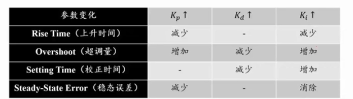

# 飞控的笔记（一）
* [来源](https://www.bilibili.com/video/BV1BD4y1G7yx?p=3)

## 飞控的软件架构
* 整体架构图
  

* 说明
  * 控制：只负责推力、姿态（或角速度），在单片机上运行。它控制电机（以及相应的包括电调）
  * 估计、感知、规划，这些在电脑上进行。
  * 轨迹和控制的关系？
    * 将轨迹进行插值，得到一个个的点（在一个点上是位置p、速度v、加速度a的数据）。其中：
      * 加速度是前馈。
      * 位置和速度是外环和内环的设定值信号，与定位系统给出的位置反馈在控制器中形成负反馈。 

## 控制
* 控制的一些目标
  * 简单悬停
    * 小姿态低速情况下，加速度比较小，近似于悬停。此时控制器可以化简化为线性控制器，  
  * 高速高机动控制
    * 非线性控制器

## 四旋翼飞行器的动力学
* 电机模型、单个电机上的推力模型、力矩模型
  
* 欧拉角的惯例，同时决定了旋转矩阵的形式 
  
* 机体坐标系到大地坐标系的转换，以及欧拉角的导数与即时角速度的转换。
  
* 牛顿欧拉方程
  
  
  * 描述合外力和和外力矩的作用下，系统在平移量和旋转量上发生的变化。
  *  牛顿方程
    * 左侧是质量乘以加速度
    * 右侧是重力+四个螺旋桨产生的垂直于桨平面的的合力并乘以（物体坐标系到大地坐标系）的旋转矩阵。
  * 欧拉方程
    * 系统的转矩。。。

* 四旋翼动力学汇总
  

##   控制系统设计
* 目录
  * 控制系统介绍
  * 基本准则
    * 线性时不变（LTI）系统
      * 简单的一阶系统
      * 简单的二阶系统
    * 控制器设计
      * 增益调节。比如 PID，在不知道模型时，调节这三个参数来模拟出原系统的模型。
      * 基于模型的控制：在知道模型时，主动调节（超前、滞后等）

* 控制系统介绍
  * 现实世界中，无论模型多么完美，一定存在外界的扰动，所以开环系统无法完成复杂控制。
  * 在无人机中，都是基于PID的增益调节的瞎猜的控制器，加上一个模型。
    
    
    注意，传感器很难直接测量某些状态量，比如位姿。所以需要一个“观测器”（observer）
    
    

* 简单一阶系统的控制
  

* 简单二阶系统的控制
  
  此处，有前馈模型时，就用上。

* PD控制和PID控制
  

* 增益调节
  

* PID的人工整定经验
  
  

* ZN整定法（仅参考，作用不大）

  

* 基于模型的控制（真实的方式）

  

  注意：

  * 基于模型的控制最大的好处是：可以用模型抵消一部分系统的动力学。
  * 例如，假设知道系统在1阶和0阶上的模型的参数准确的符合物理性质的，那么在设计闭环控制器时所要应对的就是对抗外界的扰动。而如果这里的参数有mismatch（即，不完全符合物理性质）时，此时的控制器需要同时把由这些不准确的因素所带来的响应给覆盖掉。
  * 上述的b和k参数带有hat，它们是估计值。因为不可能建出符合物理性质的完全准确的模型，所以肯定有偏差。此时会加入一个伺服。

* 将控制分为两部分的优缺点：
  

## 控制器理论应用于2-D四旋翼

* 平面旋翼为例
  
  * 假设只有y和z方向的平动，以及一个旋转角
  * 方程左侧三项：大地的y和z方向的加速度，旋转角速度
  * 右侧第一项只有重力加速度
  * 右侧第二项，F分解为y和z方向的两个例，M是整体的转矩，$I_{xx}$是？？转动惯量。 

* 平面四旋翼模型
  
  此处，右侧是矩阵形式， 也就是“状态空间”的表达式。
  另外，由于三角函数，这里是非线性的系统，需要线性化（假设无人机姿态很小时）。

* 线性化的动力学模型
  
  此处的线性化是通过角度的近似而实现，$\sin(\phi)$近似为$\phi$，而$\cos(\phi)$近似为$1$。
  级联的意思是，$y$依赖于$\phi$，$z$依赖于$u_1$，而$\phi$又依赖于$u_2$。
  所以，用两路控制器，内环的姿态控制器控制$u_2$来改变$\phi$的动力学，外环的位置控制器控制$\phi$该表$y,z$。

* 控制回路结构
  

* 线性化的动力学模型（Z轴方向位置，Y轴方向位置，姿态控制）
  
  此处，为了控制$z$，实际上是在控制$u_1$，也就是推力的合力。

  
  此处，因为$y$依赖于$\phi$，所以需要串级控制。另外，$\phi_c$表示设定值（c是command的意思)。

* 轨迹跟踪
  

## 3-D 四旋翼

首先，3D中的控制律和刚才2D中的控制律没有本质上的区别，还是从牛顿方程和欧拉方程来描述。

* 3D四旋翼
  
  
  从上式可以看到，从欧拉角到机体角速度的转换是非线性的。我们需要线性化，并且幸运的是，我们可以做。

  
  注意，此处牛顿方程是如何线性化的？我不确定$\ddot{p}_1$等的表达式对不对。可能是这样的：$\ddot{p}_3=0$，所以$\frac{u_1}{m}=g$，所以$\ddot{p}_1$中的$g$实际上是$\frac{u_1}{m}$，这样就对了。

* 设计出来的控制律
  
  注意，位置控制中的$\phi_c$表达式中的$\psi$是单独控制的（略），式中$\psi$是当前测量的yaw，而不是期望的yaw，见下图。

  
  注意，由于悬停时$\psi$与推力没有直接关系，所以是单独控制的。

* 总结一下：
  * 外环设定位置三个轴（方向）的期望值
  * 通过Z轴的平衡，解算出$u_1$
  * 偏航角yaw，即$\psi$单独控制。
  * 通过X轴和Y轴的平衡，解算出内环$\theta$和$\phi$两个角度的设定值（其中，$\psi$是测量值）
  * 从而得到了三个欧拉角的设定值，然后用于内环上的姿态控制。
  * $u_2$是由欧拉角设定值，体坐标系下三个轴上的角角速度实际值而算出的。
  * 注意：上述线性控制器，在悬停时是适用的，但对于大机动大速度飞行时是不适用的。

## 四旋翼的先进控制

* 微分平坦
  任意给定轨迹，相当于给定了一组点（任意的点都包括了：p,v,a)。
  当给定任意时刻的p,v,a后，由a就可以求出无人机期望的姿态。什么原理？因为，无人机的加速度a完全由姿态决定。怎么做？使用微分平坦工具即可得到由 a 得到期望的姿态。
  
  
  
  
  
  
  
  
  
  
* SE(3)控制
  
  此处，$T$可能是 track 的意思。
  
  
  
  
  
  

* 若想知道为什么控制律是这样，请参考“微分平坦”给出的论文，以及它所引用的论文是如何介绍SE(3) controller，这是一篇非常经典的四旋翼无人机控制的论文。自此之后，学界所有SLAM都是这样控制的。
* 说白了，
  * 首先是在位置环上，在p,v,a的平动上与之前线性的差距不大；
  * 接着，直接根据姿态的误差来解算应该给系统施加多大的扭矩，此时需要使用微分平坦的工具来解算轨迹上的一个点对应的期望姿态；
  * 然后期望姿态和实际姿态的差值就是姿态误差
    * 为什么是上图$e_R$的这个形式？其实由很多形式，只要是渐进稳定的
    * 该老师补充到，他个人对这方面没有很深的研究，希望有深入研究的同学能多交流，为什么SE(3) controller论文的作者可以证明这个函数利用利亚普诺夫稳定性判据证明它是渐进稳定的。
  * 接着，定义角速度的误差$e_{\omega}$
  * 最后， 将姿态误差和角速度误差合起来，构成了PD的姿态控制器。

## MPC控制

* Model Predict Control 模型预测控制。这是一种反馈控制算法，使用模型来预测过程的未来输出。

  参考：[模型预测控制简介（model predictive control）](https://zhuanlan.zhihu.com/p/99409532)

* 老师的一些看法

  * Planning 和 Control 的关系：可认为 P 是开环的control，而C是闭环的 planning
  * 规划只需要到 p, v, a 这一层；而 Control 负责将 p, v, a 转换到推力和扭矩(即，u1和u2)，各司其职，减少不必要的复杂度。
  * 不想把MPC当作是控制。因为如果只到达p,v,a这一层，那么MPC就会简单很多，类似于“轨迹生成”问题。
  * MPC所做的，不外乎就是，接下来每间隔时间内系统的状态应该是什么以便使得系统的指标尽可能的小。

* 例子

  

* CMPCC为例

  Corridor-based Model Predictive Contouring Control for Aggressive Drone Flight

  参考：https://zhuanlan.zhihu.com/p/386545427

  CMPCC放在顶层规划器与底层控制器之间，使得无人机能够更好地跟踪原轨迹。

  参考：[【无人飞行器】开源 | CMPCC：基于走廊的模型预测无人机激进飞行的轮廓控制](https://cloud.tencent.com/developer/article/1792656)

## 相关论文或资源

* 论文：Ji JiaLin, Minimum snap trajectory generation and control for quadrotors

* 原始论文：SE(3) geometric controller，发表在 CDC 上。

* 开源实现：[n3ctrl的github地址](https://github.com/HKUST-Aerial-Robotics/Teach-Repeat-Replan/tree/experiment/onboardd_computer/controller/n3ctrl)

  

