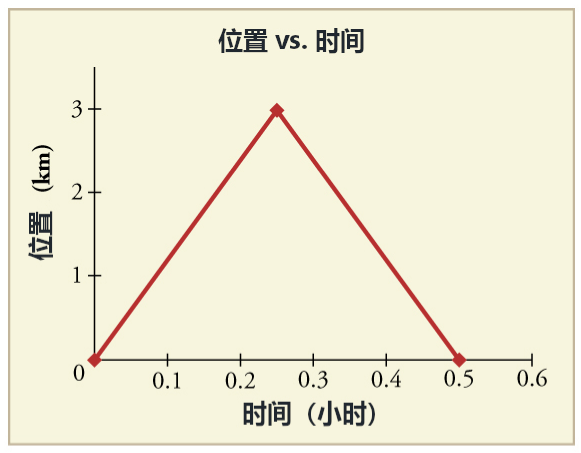
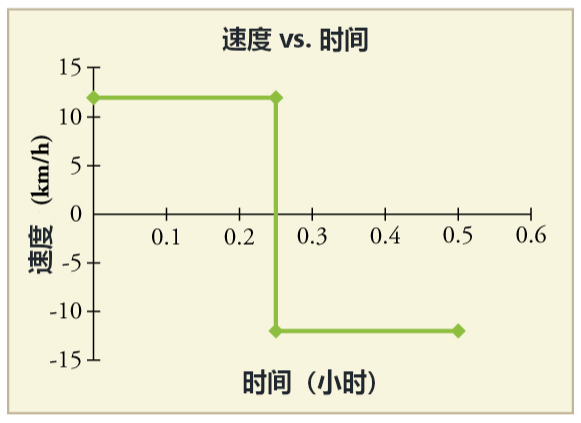
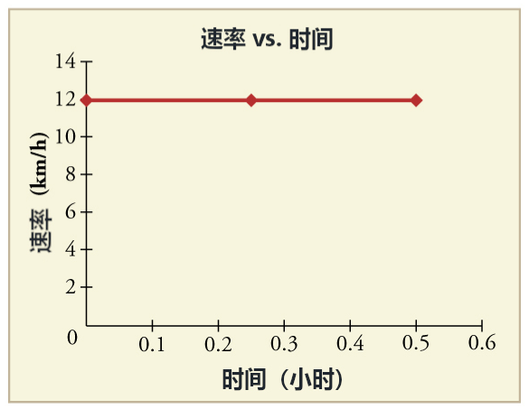

# 物理学
物理学研究的是决定我们身处的物质世界的基本原理。
我们将从运动自身开始。
然后，我们将在许多不同的实际情况中了解力、动量、能量和其它概念。

## 单元1：一维运动
* 什么是物理？
  物理学家试图做以下事情：
  1. 准确地界定宇宙中最基本的可测量（例如速度、电场、动能）。
	 寻找宇宙最基本的描述一直是物理学历史上的重要问题。
  2. 找出这些基本测量量之间的关系（例如牛顿定律、能量守恒、狭义相对论）。
	 这些规律和关系用文字、方程、图像、图表、示意图、模型和任何其他方式来表示，让我们能够更好地理解和使用这些工具来表达关系。
	
* 向量和标量（vectors and scalars）

* 参照系 (reference frames)

* 位置
  在物理学中，我们喜欢精确地描述物体的运动，因为它对我们在物理中所做的其他事情都非常重要。
  要描述物体的运动，我们必须首先能够描述它在任何特定时间的位置。
  准确地说，我们需要指定它相对于一个方便的参考系的位置。
  变量 ‍$x$ 通常用于表示水平位置，变量 ‍$y$ 通常用于表示垂直位置，变量 ‍$z$ 用于描述通常指向“屏幕外/纸外”的第三个垂直轴。
  
* 位移 displacement（以一维为例，而二维和三维在以后会扩展）
  如果物体相对于参考系移动，则物体的位置会发生变化。
  位置的这一变化称为位移。“位移”一词意味着物体已移动或已被移位。
  位移的定义是物体位置的变化。它可以用以下公式进行数学定义：
  $$
  \Delta x=x_f - x_0,
  $$
  其中，$x_f$表示最终位置的值，$x_0$指初始位置的值，$\Delta x$表示位移的符号。
  位移是矢量，意味着它有大小和方向，可以用从初始位置指向最终位置的箭头表示。
  
* 位移和路程
  要区分两点之间的位移或者物体运动的路程。
  位移 是两点之间有向线段的长度。
  路程 指物体运动轨迹的长度。路程不是矢量，它没有方向，所以没有负号。
  如果物体在其行程中改变方向，所走的总距离将大于这两个点之间的位移。
  位移只是两个标记位置的差异，与在两个标记之间移动时所走的路径无关；然而，路程是两个标记之间所走路径的总长度。
  
* 平均速度：位移除以时间
  $$
  v_{avg}=\frac{\Delta x}{\Delta t}=\frac{x_f - x_0}{t_f - t_0}
  $$
  如果开始时间$t_0$认为是0，则平均速度如下：
  $$
  v_{avg}=\frac{\Delta x}{t},
  $$
  此处的$t$代表时间差$\Delta 5$。
  此式可以告诉我们速度也是一个矢量。
  
* 瞬时速率和瞬时速度 instantaneous speed and velocity
  物体运动时，观察之间的时间间隔越短，我们就更能准确地了解物体运动的细节。
  以此类推，现实中的速度是由好多无限小的时间段中的平均速度组成的。
  我们叫这些速度 瞬时速度，或某一个具体时间的速度。
  瞬时速度 $v$ 其实就是在一个无限小的时间段中的平均速度。
  
* 速度和速率
  英语的speed和velocity常常互换使用，而且都翻译称速度，但在物理学中二者截然不同。
  速度 Velocity (v) 是向量，用来衡量随时间变化 (Δt) 而产生的位移（或位置的改变 Δs)，由方程式 v = Δs/Δt 表示，或者 $\vec{v}=\frac{\vec{s}}{\Delta t}$。
  速率 Speed (或率，r) 是一个标量，用来衡量随时间变化 (Δt) 所行驶的距离 (d)，由方程式 r = d/Δt 表示。 
  
* 以下的例子说明了速度和速率的区别。

  

  

  

* 位置-时间图
  图表一种有效的方式，可以在一个方便的小空间中直观地表示关于对象运动的大量信息。
  位置图的斜率表示物体的速度。所以某一时刻的斜率值代表了物体在这一时刻的速度。
  曲线图上的曲率表示物体的速度在改变，意味着加速度不为0。

* 加速度
  加速度 是我们对任何速度变化的称呼。
  因为速度包含大小和方向，所以产生加速度只有两种方式：改变速度或者改变方向——或者两个都改变。
  加速度被定义为速度的变化率。
  $$
  a = \frac{\Delta v}{\Delta t} = \frac{v_f - v_i}{\Delta t}
  $$
  以恒定加速度$a$运动一段时间$\Delta t$后的物体的最终速度$v_f$为：
  $$
  v_f = v_i + a \Delta t
  $$
  其中，$v_i$是初始(initial)速度，$v_f$是最终(final)速度。

* 速度-时间曲线
  速度曲线的斜率表示了物体的加速度。
  速度曲线下方的面积表示表示物体的位移。

* 加速度和时间图像
  加速度图的斜率表示急动度（jerk）（又称加加速度）。急动度是加速度的变化率。

* 运动学的公式有哪些？
  * 运动学公式是一套和以下五个变量有关的公式。
	$\Delta x$位移
	$t$ 时间间隔
	$v_0$ 初速度
	$v$ 最终速度
	$a$ 加速度
  * 运动学公式通常被写成以下四个公式：
	1. $v = v_0 + at$
	2. $\Delta x=(\frac{v + v_0}{2}) t$
	3. $\Delta x = v_0 t + \frac{1}{2} at^2$
	4. $v^2 = v_0^2 + 2a\Delta x$
    上述公式适用条件：加速度不变；所有变量作用在同一个方向。
  
  
