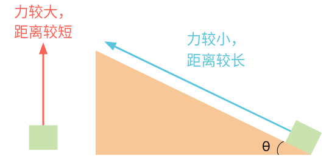

## 单元3：力和牛顿运动定律

### 课程1：牛顿运动定律
* 牛顿第一运动定律
  任何物体都要保持匀速直线运动或静止状态，直到外力迫使它改变运动状态为止。
  Law I: Every body persists in its state of being at rest or of moving uniformly straight forward, except insofar as it is compelled to change its state by force impressed.
  Remark:
  * 这个规律可以被看作成物体运动的定义。
  * 牛顿第一运动定律说明了物体运动中所有速率的变化，无论是方向上的还是速度上的，都需有外界的力导致。
* 力，外力，与净力
  * 力代表着一个物体对另一个物体产生的推/拉力，它是一个矢量。力，记为 $F$，单位是牛顿，记为 ‍$N$
  * 外力 是物体外部对物体产生的力，而不是物体自身产生的力。
    一个系统自身的力不会对其系统的运动产生影响。
  * 对某物体的净力可以被写作 ‍$\Sigma F$。
	如果有好多不同的力影响着一个物体，净力将是这些力的和。
  牛顿第一运动定律指出，如果一个物体所受到的净力为零 (‍$\Sigma F=0$), 那么这个物体的加速度将会是零。

* 质量
  导致物体保持原速度的性质叫做惯性。
  牛顿第一运动定律也可以叫做惯性定律。
  现实生活中也可以看出，有些物体有更多的惯性。
  一个物体所拥有的惯性与它的质量有关。从物体加速中就可以看出，越重的东西就越难加速。
  一件东西里有越多的物质，它的重量就越大，改变它速度的难度也就越大。

* 牛顿第二运动定律
  * 起源：由第I定律只能定性的知道外力引起运动，但不能定量的知道是如何影响物体运动状态的。
  * $F = ma$

* 牛顿第三运动定律
  如果物体 A 对物体 B 施加作用力，那么物体 B 一定同时对物体 A 施加大小相等、方向相反的力。
  Remark:
  * 这条定律本质上表示了某种对称性：力总是成对发生的，一个物体不可能只对另一个物体施加作用力，而不受到另一个物体对它的反作用力。
  * 我们可以把这个定律简单理解为作用力和反作用力定律，其中施加的力称作作用力，受到的力称作反作用力。
  * 例子：
	火箭通过向后高速排出气体而向前移动。
	直升机同样通过向下推动空气来产生升力，因为向下的推动力会产生向上的反作用力。
	鸟的翅膀向下和向后推动空气，以获得向上和向前的力。
	
### 课程2：正压力和接触力 Normal force and contact force
* 支持力：垂直于物体表面的力。在讨论摩擦力时它很重要。

* 本质上是一种电磁力，是电子之间的排斥力。
  宏观上，我们把它看作一种接触力。
  微观上，或原子层面，它是电磁排斥在其作用。
  
* 重量 (Weight) 是什么？
  重量 ‍$W$ 只不过是重力 ‍$F_g$ 的另一种说法。 
  重量是一种在任何时候都作用于地球附近所有物体的力。
  地球用指向地球中心的重力拉着所有的物体。
  重力的大小可以通过将物体质量 ‍$m$ 乘以重力加速度 $g = +9.8 \frac{m}{s^2}$ 求得。
  问：为什么g不是负的？因为重力加速度$a_g$是负的（设向上为正），而字母g表示重力加速度的大小。
  即，$g=|a_g|$。或者说 $a_g=-9.8\frac{g}{s^2}$。
  备注：地球对所有物体施加重力 $W=F_g=mg$（或称“重量”），不管这些物体如何移动，也无论是否受到其他的力。换句话说，有一个方向竖直向下、大小为 ‍$mg$ 的引力施加在地球附近的所有物体上，无论它们是在自由落体、在斜向上飞、在桌子旁边坐着休息、还是在电梯里加速上升。也可能还有其他的力对物体的加速度有贡献，但重力始终存在。
  
* 重量和质量是不同的
  重量 ‍$W$ 是施加在物体上的重力 ‍$F_g$，单位是 $N$
  质量 ‍$m$ 是对物体惯性的度量（即它抵抗速度变化的程度），单位是$Kg$。
  它们是相关的，由于 ‍$W=mg$，所以较大的质量会有较大的重量。

* 电梯上的正压力 Normal force in an elevator 

* 什么是正压力？
  正压力是表面用来防止固体物体相互穿过的力。
  正压力是一种接触力。如果两个表面没有接触，它们就不能对彼此施加正压力。
  例如，桌子和盒子的表面如果不接触，就不能相互施加正压力。
  这种正压力将根据需要变得足够大，以防止表面相互穿透。
  正压力（normal force）中的 “normal” 一词并不是指普通或普遍的。
  这里的 “normal” 指的是 垂直的 ，通常用 ‍$F_n$ 或仅仅 ‍$N$ 表示，是一种垂直于接触中的两个表面的力。
  表面也可以在平行于表面的方向施加接触力，但我们通常会将这些力称为摩擦力（因为它们有助于防止曲面相互滑动），而不是将其称为正压力。
  
* 没有生命的表面如何“知道”施加一个正压力？
  如果一个更重的物体被放在桌子上，桌子必须施加更多的正压力以阻止重物穿过桌子。桌子是怎么知道如何施加正正好好的力来阻止物体穿过它呢？
  基本上，根据表面/物体被压缩或变形的程度，桌子“知道”应该施加多大的力。当固体物体变形时，它们通常会尝试自我恢复并“回弹”到它们的自然形状。重量越重，变形越大，试图使表面恢复其自然形状的恢复力越大。
  除非物体变形超出其极限，否则它将发挥恢复力，就像变形弹簧（或蹦床以及跳板）一样。因此，当重物放在桌子上时，桌面会向下弯曲，直到恢复力变得与重物的重量一样大。
  
  

* 如何求解正压力？
  没有一个专门为求正压力而制定的公式。为了找到正压力，我们通常使用这样一个事实，即我们知道一些与表面垂直的加速度（因为我们假设曲面不能相互穿过）。因此，我们几乎永远用牛顿第二定律来解决正压力问题。
  1. 绘制受力分析图，标明作用于所述物体上的所有力。
  2. 在与正压力相同的方向上选择牛顿第二定律的方向（即垂直于接触表面）
  3. 为该方向代入加速度，质量和作用力到牛顿的第二定律 ($a=\frac{\Sigma F}{m})
  4. 求解正压力 $F_n$。
  从本质上讲，我们是通过假设因为正压力需要防止表面穿透对方将按需变大或变小，来求解正压力。

### 课程3：倾斜的平面和摩擦力
* 倾斜平面上力的分量（Inclined place force components)

* 摩擦力让滑块静止 Force of friction: stationary block

* 摩擦力让速度保持不变 Force of friction: constant velocity
  比如在斜坡上下滑。

* 直观上对静摩擦力和动摩擦力的比较
  为什么静磨擦力比动摩擦力更难克服？
  摩擦力 $f = \mu N$
  动摩擦系数小于等于静摩擦系数 $\mu_k\le\mu_s$
  需要深入到原子层面：
  * 虽然一直在说“接触力”，实际上并没有真正意义上的完全接触。原子之间相互排斥，因为存在电子。相互之间的电磁池里不允许它们太过靠近。推动物体时，本质是手上的电子云推物体上的电子云。原子的大部分是自由空间，电子云比原子核大很多。可理解为大量自由空间通过电磁力推向其他大量自由空间。
  * 对于静摩擦，一开始可认为粒子相互契合得很好，相当于嵌入到这些“凹槽”中。如果想以某力让物体加速运动，就需要更大的力来克服阻力。比如把有些一部分粒子“挪走”。这些事情肉眼察觉不到，因为分子层面太小。
  * 对于动摩擦，一旦开始运动，粒子没有机会嵌合到这些“凹槽”中。在原子之间还有一些化学键，在原子不断临时性的结合或断裂时，这些键会结合或断开。
  * 静止时，不仅有这些化学键，还有一些粒子嵌入到“凹槽”中。直观上讲大概是这样。

* 什么是摩擦力？
  静摩擦力 ‍$F_s$ 是阻止两个平面互相滑动的力。
  即使两个平面开始滑动，也可能会有摩擦力，这种摩擦力被称作动摩擦力。
  动摩擦力 $F_k$ 总是与运动方向相反，并尝试减慢平面相互滑动的速度。
  在物理学上，为什么会有摩擦力呢？
  大多数表面 (如木材和塑料) 在肉眼看来都相当光滑。但如果你放大, 你会发现表面在微观层面上是粗糙的。例如, 在微观层面上，下图所示的盒子和地板的表面实际上是粗糙和锯齿状的。

* 动摩擦力 $F_k$ 公式是什么?
  $$
  F_k = \mu_k F_n
  $$
  这表明动摩擦系数 $\mu_k$ 是一个无量纲量（即没有单位的值，没有物理尺寸）。

* 静摩擦力 $F_s$ 公式是什么?
  静摩擦力与动摩擦力稍有不同。第一，静摩擦力会根据施加在未移动物体上的力而变化。第二，一旦运动起来比从静止开始让它运动更容易，就说明动摩擦力小于最大静摩擦力。
  我们可以找到两个平面之间的最大静摩擦力。
  $$
  F_{s~max} = \mu_s F_n
  $$
  还可以用不等号表示$F_s$，即
  $$
  F_{s} \le \mu_s F_n
  $$
  要小心，$F_{s~max}$ 的值只给出我们最大可能的静摩擦力，不是在情境中的 实际 静摩擦力。
  例如，如果洗衣机和瓷砖地面最大静摩擦力为 ‍$F_{s~max}=50N$。如果你用 ‍$30N$ 的力尝试挪动洗衣机，那么静摩擦力只会有 $30N$。
  一旦洗衣机开始滑动，也就只有动摩擦力，没有静摩擦力。

* 斜面是什么？
  公园里的滑梯、陡峭的车道和运输卡车的装载坡道都是斜面的例子。斜面 或 倾斜平面 是物体可以坐在上面、向上滑动、向下滑动、向上滚动或向下滚动的对角线表面。
  斜面很有用, 因为它们可以减少垂直移动对象所需的力。它们被认为是六个经典的简单机械之一。
  六个经典的简单机械是可以给一个人带来机械优势 (即减少执行任务所需的力量)的机械设备。六个简单机械分别是：杠杆、车轮和车轴、滑轮、斜面、楔形和螺丝。
  
  

* 在处理斜面时如何运用牛顿第二定律？
  对于倾斜, 我们通常关注与倾斜表面平行的运动, 因此通常更有用的方法是运用牛顿的第二定律来解平行 和 垂直于倾斜表面的方向的力。
  
  
  于是，在垂直和平行于斜面的方向上有：
  $$
  a_{\perp}=\frac{\Sigma F_{\perp}}{m},\quad a_{\parallel}=\frac{F_{\parallel}}{m}
  $$
  由于质量通常与斜面表面平行滑动, 并且不会垂直于坡度表面移动, 因此我们几乎总是可以假定‍$a_{\parallel}=0$。 

* 找到斜面上的物体的重力的垂直和平行分量
  
  

### 课程4：张力
* 什么是张力？
  所有互相接触的物体都可以相互施加力。我们根据接触对象的类型给这些 接触力 不同的名称。如果施加力的物体中的一个恰好是绳子、线、链子或电缆, 我们称这种力为 张力。
  
  
  
  绳索对于作用力很有用, 因为它们可以在很长的距离 (例如绳子的长度) 上有效地传递力。
  这里需要注意的是, 张力是一种拉力, 因为绳索根本不可能用来推。
  要记住, 张力只能拉物体。

* 如何计算张力？
  不幸的是, 没有特别求张力的公式来。为寻找张力而采取的策略与我们用来寻找正向力的策略相同。也就是说, 我们使用牛顿第二定律将物体的运动与所涉及的力联系起来。
