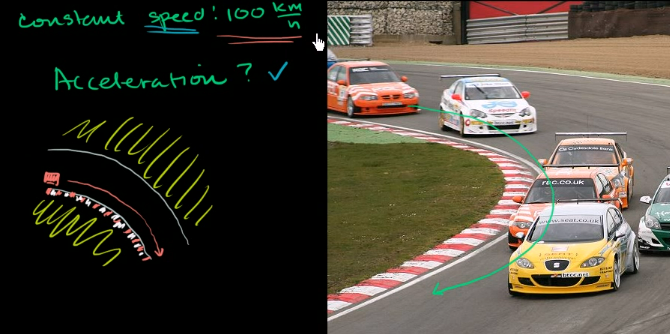
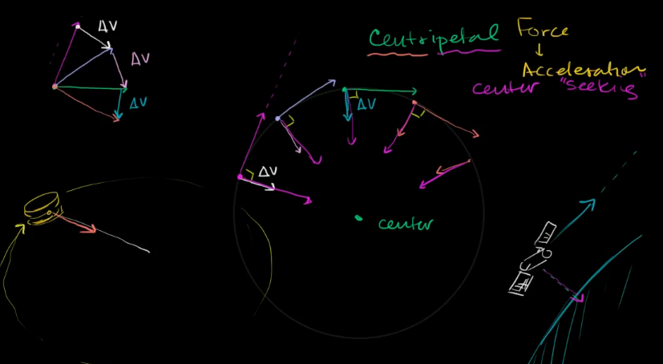
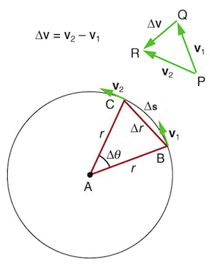

## 单元4：向心力(Centripetal force)与引力(Gravitation)

### 课程1：圆周运动和向心加速度(Circular motion and centripetal acceleration)

* 赛车沿弯道以恒定的速率行驶
  请问，这些车加速了吗？虽然里程表的车速没有变，但它们确实加速了。
  
  
  
  此处，速度和速率的差别开始重要了。
  加速度是速度的变化量除以时间，即$\vec{a}=\frac{\Delta \vec{v}}{\Delta t}$
  赛车的加速度一点点在向里改变，它们向着曲线的中心加速。这就是导致方向改变的原因。
  
* 向心力和加速度的直观理解

  

* 向心加速度公式的视觉化理解

* 什么是向心加速度?
  一个匀速移动的物体能否有加速度? 是可以的! 很多人在开始的时候会觉得这个概念很难理解，因为他们忘记了，物体运动方向的改变——即使物体的运动是匀速的——仍然会产生加速度。 
  在匀速圆周运动中, 速度的方向一直在变化, 所以总是有一个与之相关的加速度, 即使运动速率可能是固定的. 你自己也会在开车转弯时体会这种加速度—如果你把住方向盘并以固定的速度前进, 你就在做匀速圆周运动. 你所注意到的是一个侧向的加速度因为你和车都在改变前进方向. 越急的弯或者越快的速度, 都会导致这个加速度变得更明显.
  下图展示了一个沿着圆周进行匀速运动的物体.
  
  

  该图显示了一个物体在两个不同的点 B 和 C 上的速度的方向, ‍以及速度的变化$\Delta v$，看上去大致是指向圆弧中心的。如果想知道瞬时的变化, 点 ‍B 和 ‍C 必须无限接近。此时 $\Delta \theta$非常小，我们会发现 ‍$\Delta v$直指向圆周的中心。又因为$a_c=\frac{\Delta v}{\Delta t}$，加速度也是向着中心的。因为$\Delta \theta$非常小，弧长$\Delta s$在极小的时刻中等于弧长$\Delta r$。
  
  图中显示了两个路径上的点上的瞬时速度的方向. 加速度是速度的方向的变化, 并且指向旋转运动的中心—也就是圆周的圆心. 矢量图中表示了这个方向.
  我们将一个进行匀速圆周运动的物体受到的加速度—由一个净外力产生的—称为`向心加速度`；向心的意思是 “朝着中心” 或者 “向着中心”。
  向心加速度的方向是直指向圆周中心的, 但是它的大小是多少呢? 注意由速度向量形成的三角形和由半径$r$和弧长$\Delta s$形成的三角形是相似的. 三角形$ABC$和$PQR$都是等腰三角形. 速度向量三角形的两条腰是$v_1=v_2=v$。使用相似三角形的性质, 我们得到
  $$
  \frac{\Delta v}{v}=\frac{\Delta s}{r}
  $$
  又因为加速度是$\frac{\Delta v}{\Delta t}$，所以从上面的表达式可得
  $$
  \Delta v = \frac{v}{r}\Delta s,\quad 
  a_c = \frac{\Delta v}{\Delta t}=\frac{v}{r}\frac{\Delta s}{\Delta t}=\frac{v}{r}v=\frac{v^2}{r}
  $$
  所以，这是一个沿着半径 ‍$r$ 以速度 ‍$v$ 进行圆周运动的物体所受到的加速度。
  所以, 向心加速度在速度更高或者弯更急（也就是较小的半径）的情况下更大。
  
* 向心加速度公式的微积分证明

### 课程2：向心力(Centripetal force)
* 什么是向心力?
  向心力是一种作用在物体上使物体沿着圆周进行运动的净力.
  之前讨论了向心加速度，然而，我们应该先讨论物体是如何沿着圆周运动的。
  理解向心力不是一个 `基本力` 是很重要的, 而只是一个给使得物体沿着圆周运动的 `净力` 的标签. 
  可能包含多个单独的力，只要他们加起来 (通过向量加法) 能形成一个指向圆周中心的净力.
  根据牛顿第二定律 $ a = F / m $，让它与向心加速度相等，$v^2/r = F/m$，可得向心力$F_c$是：
  $$
  F_c = \frac{mv^2}{r} = mr\omega^2,
  $$
  其中，$\omega$是角速度，因为$v=r\omega$。向心力$F_c$的方向始终指向圆周的中心。

* 绳球

### 课程3：牛顿万有引力定律
* 重力简介
* 牛顿万有引力定律的介绍

