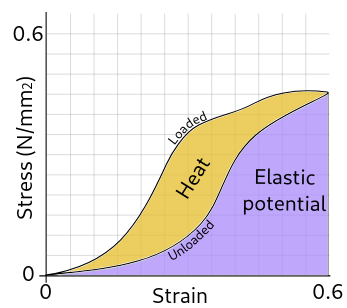

## 单元5：功与能 Work and energy
* 概论
  Work: energy transfered by Force
  Energy: ability to do work
  Work = Force . disance, eg: 10N.7m = 70 N.m = 70 Joule

* 能量和功是什么?
  能量是用来衡量一个东西做功的能力的. 它不是一个物质. 能量可以以很多形式被储存和测量. 
  能量从未真正的被销毁. 它只是从一种形式转化成了另一种形式, 并在过程中做功. 一些形式的能量就不如另一些形式的能量对我们来说有用。
  现实中, 任何时候只要做功将一种形式的能量转换成另一种形式的能量, 总会有一些能量转化成了比如热能和声能而产生损失. 

* 怎么衡量能量和功?
  物理中用来测量能量和做的功的标准单位是 焦耳, 符号是 J. 
  在机械中, 1 焦的能量是用 1 牛顿的力推动一个物体前进了 1 米.
  另一个用来描述能量的单位是 千卡路里 (kcal)。每千卡路里相当于是 4184 焦耳。
  比如一块常见的 60 克的巧克力大概含有 280 千卡路里的能量，约 1.17 百万焦耳或 1.17 兆焦耳的能量。
  一千卡路里是将 1 千克水升高 1‍ 摄氏度所需要的能量。
  
* 需要推一个重箱子多远才能完全消耗一块巧克力?
  将一个体重秤放在我们和箱子中间, 我们发现我们可以用 500 牛顿的力推动这个箱子. 同时, 我们使用一个秒表和卷尺来测量我们的速度. 测出来速度是 0.25 米每秒.
  那么我们需要对箱子做多少功才能完全消耗那块巧克力? 如下：
  功的定义为：$W=F\cdot \Delta x$，
  我们消耗那块巧克力要做的功的量是 $E=280 kcal \cdot 4184 J/kcal = 1.17MJ$，
  因此, 我们需要移动箱子的距离是：$\Delta x=E/F = 1.17MJ / 500N = 2340 m$
  然而 我们的身体在转换食物到能量的效率只有 25%，因此实际消耗的食物能量是对箱子做功的4倍。所以，只需要推箱子 585米，这仍然是超过过5个足球场的长度（足球场标尺寸是100米乘60米）。
  根据速度，还能算出需要的时间是：$585m/0.25m/s=2340s=39分钟$。
  
* 单位问题
  $1 J = 1 N.m$
  $1 N = 1 kg . \frac{m}{s^2}$
  $1 J = 1 kg.\frac{m}{s^2}.m = 1kg\frac{m^2}{s^2}$

* 什么是动能 kinetic energy ?
  动能是一个物体因为运动而拥有的能量。
  如果我们想改变一个物体的速度, 那么我们需要对它施力。施力的过程又被称为做功。当外力对一个物体做了功后，这个物体将从中获得动能，并且其恒速移动的速度会发生改变。所以，做功即是能量转为动能的过程。它获得的动能大小取决于这个物体的质量和它的速度上的变化。
  动能可以在物体之间传递, 同时也可以被转化为其他形式的能量。
  
* 如何计算动能?
  我们先需要找出某外力$F$, 对物体做的功$W$。
  假设一个物体重量为 ‍$m$, 并且被一个与移动平面平行的力移动的距离为 ‍$d$。
  $W = F.d = m.a.d$
  当加速度恒定时，由$d=\frac{v_f^2 - v_0^2}{2a}$可得
  $W=m.d.a=m.d.\frac{v_f^2-v_0^2}{2d}=\frac{1}{2}.m.v_f^2 - \frac{1}{2}.m.v_i^2$。
  所以，
  * 设初速为0，对某个物体匀加速做功到达速度$v$时，动能$\frac{1}{2}mv^2$。
  * 设初速为v，对某个物体匀减速做功到达速度$0$时，动能$\frac{1}{2}mv^2$。
  动能：
  $$K=\frac{1}{2}mv^2$$
  同样，物质/系统的动能变化也等于受到的功的量。
  $$W_{net}=\Delta K$$
  这也叫做功能定理。

* 动能有什么特殊的地方?
  * 物体的动能与物体的速度平方成正比。这意味着如果物体的速度翻倍，它的动能将翻四倍。
  * 动能不能为负。 虽然速度可以有正负，但是任何数字的平方都将是正的。
  * 动能不是矢量。

* 练习2: 肼是一种火箭推进器燃料。它的能量密度 ‍$E_d$是$1.6\frac{MJ}{kg}$。假设一个 100 千克的火箭 (‍$m_r$) 中装载了 1000 千克的肼 (‍$m_p$)。它可以达到什么速度? 假设所有的燃料在很短的时间内同时燃烧，并且火箭自身没有受任何的外力的影响。
  解：在推进剂中储存的总能量为 ‍$E_d.m_p$。如果我们把它当动能对待, 我们就会得到
  $\frac{1}{2}m_r.v^2=E_d.m_p$
  得到速度$v$：
  $v=\sqrt{\frac{2.E_d.m_p}{m_r}}=5657 m/s$
  通常，地球轨道内的航天器的速度一般约为 7km/秒，这里似乎非常接近于实现这个速度。实际情况并非如此。
  一个真正的火箭中的推进剂不会同时点燃；还未用掉的剩余的燃料也会增加火箭的重量；大气中与空气的摩擦也会使火箭失去动能。
  尽管如此，推进剂的能源密度以及推进剂质量与火箭质量之间的比例在火箭研发中至关重要。
  真正的火箭在升空过程中会不断的抛弃不必要的重量，比如说已经没有燃料的推进器。这将帮助火箭从每一滴燃料中获得更多的动能，最后才能进入轨道。

* 引力或重力
  引力或重力(gravitation/gravity)是造成所有具质量或能量的物质之间相互吸引的作用，属一种基本相互作用；其为地球表面物体重量的来源。
  由于物理学概念的发展，术语语义也随时代有变化；在严格区分术语的定义下，引力（gravitation）或称万有引力，用于天体之间的相互作用 ，而重力（gravity），用于地球对其上物体的作用。

* 什么是重力势能 gravitational potential energy?
  所有保守力（Conservative forces）都有与之相关的势能；引力(The force of gravity, gravitational force)也不例外。重力势能通常用 ‍$U_g$符号表示。它表示一个物体由于位于引力场中的一个特定位置而做功的可能性。
  重力势能是能用于大规模实际储能的极少数形式之一。风能和太阳能资源中多余的电能需要进行大规模的储能，以便在用电高峰时输送到电网。而重力势能可以通过抽水蓄能水力发电系统来实现。

* 如果引力场不均匀呢?
  如果问题涉及到很大的距离，我们就不能再假设引力场是均匀的。如果我们回想一下 牛顿万有引力定律，两个质量 ‍$m_1$ 和 ‍$m_2$ 之间的引力会随着距离 ‍$r$ 平方 的增加而减小。如果 ‍$G$ 是 引力常数，那
  $$F = \frac{Gm_1m_2}{r^2}$$
  当处理大距离的重力势能时，我们通常会选择零点的位置，这可能看起来违反直觉。我们把重力势能的零点放置在一个距离为r的 无穷远处。这使得 所有的 重力势能为负。
  这样做是有意义的，因为当距离 ‍$r$ 变大时，重力很快趋向于零。 当你接近一颗行星时，你就会被重力束缚在这颗行星上，并且需要很大量的能量才能逃逸。 严格来说，只有当 ‍$r=\infty$ 时，你才能逃逸。
  对于离开地球的航天器来说，这可能发生在距离地表 ‍$5.10^7$米的高度，大约是地球直径的四倍。在那种高度下，重力加速度已经下降到地表值的1%左右。
  
* 能量守恒定律(principle of conservation of energy)是什么？
  在物理学中，守恒 一词指不会改变的东西。它在事件之前和之后都具有相同的值。
  物理学中有很多守恒的量。
  在力学中，有三个基本量是守恒的。 分别是 能量(energy)，动量(momentum) 和角动量(angular momentum)。
  在力学问题中，我们很有可能会遇到包含 动能 (‍$E_K$)，重力势能 (‍$U_g$)，弹性势能(‍$U_s$)，和 热 (热能) (‍$E_H$) 的系统。这些问题通常是通过在系统中寻找初始时刻（下标 i ）和某个时刻（下标 f）之间的能量守恒来解决。
  $$E_{Ki}+U_{gi}+U_{si}=E_{Kf}+U_{gf}+U_{sf}+E_{Hf}$$
  它可以被展开为：
  $$\frac{1}{2}mv_i^2 + mgh_i + \frac{1}{2}kx_i^2 = 
	  \frac{1}{2}mv_f^2 + mgh_f + \frac{1}{2}kx_f^2 + E_{Hf}$$

* 什么是机械能(mechanical energy)？
  机械能 ‍$E_M$ 是一个系统中势能和动能的总和。
  $$E_M = E_P + E_K$$
  只有 保守力（在新窗口中打开）（比如重力和弹力）有与之相关的势能。非保守力（比如摩擦力和拉力）则没有。我们总是可以取回通过保守力向一个系统中做的功。然而通过非保守力做的功则很难恢复。它们通常最终以热或者其他的形式逸散到系统外——换句话说，转移到环境中去了。
  机械能守恒只有在当所有力都是保守力的时候才适用。幸运的是，在很多情况下非保守力都可以忽略不计，或者至少在忽略它们的时候也可以做出一个合理的估计。
  应用能量守恒定律可以让我们快速地解决这些原本使用 运动学方程(kinematic equations) 会特别复杂的问题。

* 什么是热能（thermal energy）？
  热能 是指一个系统内包含的能量，决定该系统的温度。热能的流动就是热量。物理学中的一大分支 热力学，就是在研究不同系统之间的热量传递的规律。
  在研究机械运动时，我们通常看到热能的作用是确保 能量守恒。真实世界中物理系统的能量转换几乎全都低于100%，这会导致一些热能的产生。这些热能通常属 低阶 的热能。这里的低阶是指产生热能的系统温度跟环境温度相差不大。只有在温度差异较大的时候才有可能做功，因此低阶热能意味着能量转换'已到尽头'。继续有意义的做功已无可能，能量现在算是'散逸到环境中'了。

* 摩擦产生的热能
  举个例子，一个人匀速在粗糙的地板上向前推箱子。由于 摩擦力 是 非保守力，所做的 功 并没有转化成势能。由摩擦力所做的 所有 的功，都转化成了箱子-地面系统的热能。这些热能作为热量流入箱子-地面系统，最终提高了这两个物体的温度。

* 阻力产生的热能
  物体在空气或水这样的流体中受到的 阻力 是另一种非保守力。
  当物体在流体中运动，物体的一部分动量会传递到流体中，导致物体周围流体物质的运动。当物体停止运动后，流体仍然会运动一段时间，然后运动会停止。这是因为大规模的流体运动最终分散开，分布成流体分子的较小的随机运动。流体分子的这种运动就体现了系统热能的增加。

* 什么是功率？
  功率是衡量做功速度（或能量转移的速度）的指标。

* 如何测量功率？
  用于测量功率的标准单位是瓦，符号是 ‍$W$ 。该单位是以苏格兰发明家和实业家詹姆斯·瓦特的名字命名的。
  根据定义，一瓦特等于每秒完成一焦耳工作量。
  因此，如果 ‍$P$ 代表以瓦为单位的功率，‍$\Delta E$ 是能量的变化（焦耳数），$\Delta t$ 是以秒为单位的已花费时间，那么：
  $$P = \frac{\Delta E}{\Delta t}$$
  还有另一种功率单位仍然被广泛使用：马力。通常用符号 hp 表示，其起源于17世纪，指的是当用于转动绞盘时一匹普通的马的力量。公制马力 被定义为在1秒内提升 ‍$75kg$ 质量1米所需的功率。1马力等于 746W。
  
* 如何测量变化的功率？
  至少有三种方式表示与此相关的功率：瞬时功率 ‍$P_i$，平均功率 ‍$P_{avg}$ 和 最大功率 ‍$P_{pk}$。
  瞬时功率是在给定时刻测量的功率。

* 练习2：一个最大功率和平均功率之间存在巨大差异的设备被称为超短脉冲激光。它们被用于物理研究，可以在极短时间中产生非常明亮的光脉冲。

* 功率的概念能否帮助我们描述物体如何移动？
  根据$P=\frac{\Delta E}{\Delta t}=\frac{F\Delta x}{\Delta t}=F.v$
  对于瞬时功率，$P_i = m.a.v$
  对于平均功率，$P_{avg} = m.a.\frac{1}{2}(v_f + v_i)$
  应用举例：假设一辆汽车的质量为 ‍$1000kg$，并且广告说车轮的功率输出为 ‍$75kW$（约 ‍$100hp$）。该广告商声称它在$0-25 \frac{m}{s}$的范围内持续恒定加速。找出汽车在理想条件下从零加速到 25 m/s 应该花费的时间。
  由 $P_{avg} = m.a.\frac{1}{2}v_f=m.\frac{v_f}{t}.\frac{1}{2}v_f=\frac{mv_f^2}{2t}$，
  所以，$t=\frac{mv_f^2}{2P_{avg}}=\frac{(25m/s)^2.1000kg}{2.75000W} = 4.17s$

### 课程2：弹簧和胡克定律
* 什么是弹簧 spring?
  弹簧是一种物体，它可以被力变形，在力被移走后又恢复到原来的形状。
  弹簧有很多种不同的形式，但简单的金属线圈弹簧可能是最常见的。
  弹性 是构成弹簧的导线的基本特性。一根又长又直的金属线也有在拉伸或扭转动作后“弹回”的能力。把导线绕成弹簧，允许我们用很小的尺寸利用一长段导线。这对于建造机械设备来说要方便得多。
  
* 当材料变形(deformed)时会发生什么?
  当一种力作用于一种材料上时，该材料就会受到这种力的拉伸或压缩(stretches or compresses)。
  在力学中，单位面积上施加的力是重要的，这叫做 应力(stress) (符号 ‍$\sigma$)。材料对应力的响应产生的拉伸/压缩的程度称为 应变(strain) (符号‍$\epsilon$)。应变是由长度‍$\Delta L$与原始长度‍$L_0$在应力方向上的差值之比来测量的，i.e. ‍$\epsilon=\Delta L/L_0$
  每种材料对应力的反应是不同的。对大多数材料来说，施加小应力时所经历的应变取决于材料内部化学键的紧密程度。材料的刚度直接与材料的化学结构和化学键的类型有关。当应力被消除时，会发生什么取决于原子移动的距离。变形大致有两种类型:
  1. 弹性变形(Elastic deformation)。当应力消除后，材料恢复到施加载荷之前的尺寸。变形是可逆的，非永久性的。
  2. 塑性变形(Plastic deformation)。当材料受到大应力时就会发生这种情况。应力如此之大，以致于当材料被移除时，不会弹回原来的尺寸。有一种永久的、不可逆的变形。产生塑性变形的应力的最小值称为材料的 弹性极限。
  任何弹簧都应设计和指定，使其仅在正常操作下装入机器时才会经历弹性变形。

* 胡克定律
  许多材料的应力与应变曲线有一个线性地区。在一定范围内，拉伸弹性物体(如金属弹簧)所需的力与弹簧的伸长成正比。这就是所谓的胡克定律，通常是这样写的:
  $$F = -kx$$
  其中，‍$F$是力，‍$x$是扩展/压缩的长度，‍$k$是一个比例常数，称为 弹簧常数，通常在‍$N/m$中给出。
  虽然我们还没有明确地确定力的方向，但习惯上要加上负号。这表示弹簧所产生的 恢复力 与引起位移的力的方向相反。向下拉弹簧将导致弹簧向下的延伸，从而导致弹簧产生向上的力。

* 杨氏模量(Young's modulus)和组合弹簧(combining springs)
  杨氏模量(也称为弹性模量)是测量材料弹性变形阻力的一个数字。这是以17世纪物理学家托马斯 杨命名的。材料越硬，其杨氏模量越高。
  杨氏模量通常用符号‍$E$表示，定义为:
  $$
  E = \frac{\sigma}{\epsilon} = \frac{应力}{应变}
  $$
  我们可以直接从材料的杨氏模量中得到弹簧常数‍$k$
  $$
  k = E\frac{A}{L},
  $$
  其中，$A$是施加力的面积‍，$L$是材料的标称长度‍。
  当考虑弹簧组合的性质时，这是一个非常有用的关系。

* 什么是弹性势能？
  由于被施加 力 而发生弹性形变的物体，其因此储存的能量叫做 弹性势能 。直到力从物体上移开，这个能量才会消失，物体在恢复原本的形状过程中 做功 。这种形变包括压缩、拉伸或者扭曲物体。

* 橡皮筋的应力应变图

  

### 课程3：机械效益(mechanical advantage)

