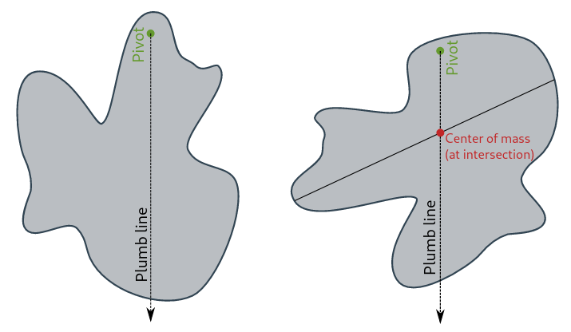

## 单元6：碰撞与线性动量

### 课程1：动量和冲量(momentum and impulse)

* 动量是什么?
  动量 是对运动中质量的测量: 多少的质量运动多少。它通常被符号‍$\mathbf{p}$表示。 
  $$\mathbf{p}=m.\mathbf{v}$$
  其中，$m$是质量，‍$v$是速度。动量的标准单位是 ‍$kg.m/s$, 动量始终是一个 向量。这种简单的关系意味着, 将物体的质量或速度增加一倍, 动量也会增加一倍。
  动量的有用之处在于它与 力 的关系。 你可能还记得, 运动学方程 里速度变化‍$\Delta v$也能被写为‍$a.\Delta t$。然后，我们可以看到，加速后动量的任何变化都可以写成：
  $$\Delta \mathbf{p} = m.\Delta v=m.\mathbf{a}.\Delta t=\mathbf{F}.\Delta t$$

* 冲量是什么?
  冲量是一个术语, 它量化了力随着时间的推移而作用的整体效果。它的符号为 ‍$\mathbf{J}$, 并以牛顿-秒表示。 
  对于一个不变的力，‍$\mathbf{J}=\mathbf{F}.\Delta t$。
  这正好相当于动量的变化 ‍$\Delta \mathbf{p}$。这种等价被称为 冲量-动量定理(impulse-momentum theorem)。由于冲量-动量定理, 我们可以在力如何在物体上的作用与物体的运动之间建立直接的联系。
  冲量之所以重要和有用, 原因之一是在现实世界中, 力量往往不是不变的。
  
* 动量守恒定律是什么?
  动量守恒主要用于描述物体之间的碰撞。
  动量守恒只适用于物体的 孤立系统中。如果下标 ‍$i$和 ‍$f$表示系统中对象的初始和最后动量, 则动量守恒原理写成
  $$\mathbf{p}_{1i} + \mathbf{p}_{2i} + ... = \mathbf{p}_{1f} + \mathbf{p}_{2f} + ...$$

* 为什么动量是守恒的？
* 动量守恒有什么有趣的地方？
* 利用动量守恒可以解决什么样的问题?

* 什么是二维碰撞 (2-dimensional collision problems)?
  如果两个物体正面碰撞，它们可以弹跳并沿着它们接近的方向移动(即只有一个维度)。然而，如果两个物体发生擦边碰撞，它们在碰撞后会在二维空间中移动(就像两个台球之间的擦边碰撞)。
  对于物体在二维空间(如x和y)中运动的碰撞，动量在每个方向上都是独立守恒的(只要在这个方向上没有外部冲量)。即
  $$\Sigma p_{xi} = \Sigma p_{xf},\quad \Sigma p_{yi} = \Sigma p_{yf}$$

### 课程2：弹性碰撞和非弹性碰撞(Elastic and inelastic collisions)

* 弹性碰撞(elastic collision)是什么?
  弹性碰撞是指在碰撞过程中系统的动能没有净损失的碰撞。动量和动能在弹性碰撞中都是守恒量。

* 为什么我们要把碰撞近似为完全弹性的?
  在实践中，它通常是非常有用的。这是因为动能守恒的要求为运动方程提供了额外的约束。这使我们能够解决那些本来会有太多未知数的问题。

* 什么是非弹性碰撞?
  非弹性碰撞是一种动能损失的碰撞。在非弹性碰撞中，系统的动量是守恒的，而动能不是。这是因为动能转移到了别的地方。热能、声能和材料变形可能是罪魁祸首。
  在现实世界中，大多数碰撞介于完全弹性和完全非弹性之间。一个球从一个表面以上的高度‍$h$落下，通常会反弹到低于‍$h$的高度，这取决于球的硬度。这种碰撞简单地称为非弹性碰撞。

* 弹性碰撞和非弹性碰撞，哪一种更具破坏性?
  这取决于你担心的是什么——车辆还是乘员!
  假设一辆汽车与另一物体发生弹性碰撞。汽车必然会反弹。当车辆反弹时动量的变化比等效非弹性碰撞时要大。因此，对乘客的作用力更大，这显然对乘客更不利。另一方面，由于它是弹性碰撞，在变形过程中不会耗散能量。因此，对车辆结构的损害将减至最低。
  现代车辆的设计目的是在发生事故时利用非弹性碰撞和弹性碰撞。车辆的车架设计是为了在碰撞中吸收能量，通过在车辆结构中内置的 变形带 。然而，车内的乘客舱设计得很坚固，因此对乘客的伤害被降到最低。

### 课程3：质心（center of mass）
* 什么是质量中心？
  质量中心（简称质心） 是相对于物体或者物体系统定义的位置。它是一个系统的所有部分根据质量进行加权的平均位置。
  对于密度均匀的简单刚性物体，质心位于其几何中心。例如，均匀圆盘的质心位于其正中心。有时质心不在物体上。例如一个圆环的质心位于其中心，而其中心不在圆环上。
  
  
  
  对于更复杂的形状，我们需要一个更普遍的质心的数学定义：它是 一个唯一位置，使得系统中所有部分的加权位置矢量总和为零。

* 质心有什么作用？
  物体或系统的质心的有趣之处在于，物体上任何均匀力等效作用于这一点。此特性使得我们可以很容易地解决包含不规则形状的物体和复杂系统的运动的力学问题。
  为了计算简便，我们可以假设一个奇怪形状的物体的质量全部集中在一个位于质心的极小的物体上。我们称这个虚构的物体为 质点（point mass）。
  如果我们在一个刚性物体的质心推动该物体，那么这个物体将会像质点一样移动。无论其实际形状如何，它都不会绕任何轴旋转。如果物体在其它一点受到不平衡的力，那么它就会开始围绕质心旋转。
  
* 如何寻找任何物体或系统的质心？
  一般来说，质心可以通过对指向系统中每个物体的位置矢量进行 矢量相加 来找出。一个可以让我们避免进行矢量运算的小技巧是分别找出质心在每个坐标轴上的位置，即
  $$
  COM_x = \frac{m_1.x_1+m_2.x_2+...}{m_1+m_2+...},\quad
  COM_y = \frac{m_1.y_1+m_2.y_2+...}{m_1+m_2+...},\quad
  $$
  合在一起，它们提供了系统质心的完整坐标$(COM_x,COM_y)$。
  复杂的物体通常可以被表示为质量均匀的简单形状的集合。然后，每个组成形状可以被表示为位于其几何中心的质点。物体的中空部分甚至可以通过负质量来表示。
  
  
  图中，我们可以将这个物体分成四个矩形和一个圆形。这个材料具有均匀的密度，因此质量与面积成正比。为了简单起见，我们可以用“单位正方形”表示每个部分的质量，如图所示。
  在$x$方向，质心位于
  $$
  \frac{16*10+52*4+12*7.5+16*10+(-7.1)*4.5}{16+52+12+16-7.1}=6.6,
  $$
  其中，圆形中空部分的面积是$\pi\cdot 1.5^2\simeq 7.1$，它需要用负质量表示。
  在$y$方向：
  $$
  \frac{16*13+52*7.5+12*7.0+16*2+(-7.1)*7.5}{16+52+12+16-7.1}=7.4
  $$

* 什么是重心（center of gravity）？
  重心 是重力等效作用于物体或系统的点。在大多数力学问题中重力场被认为是均匀的，因此重心与质心的位置完全相同。术语重心和质心往往可以互换使用，因为他们通常处在同一位置。

* 如何确定一个真实物体的质心位置？
  有几个有用的实验可以用来寻找刚性物体的质心。
  * 桌沿法(The table edge method)。
  
    
	
	可用于寻找至少有一个平面的小型刚性物体的质心。在不转动物体的情况下将物体缓缓推向边缘。当物体悬空即将坠落时，在物体上画出与桌子边缘接触的线。将物体旋转90°，然后重复此过程。两条线的交点就是物体质心在桌子所在平面的质心位置。
  * 铅锤法（The plumb line method）
	
    

	对于可以自由悬挂在一点的物体很有用。一个穿了线挂在墙上的不规则纸板就是一个很好的例子。纸板可以在重力作用下绕线孔自由旋转直到达到一个稳定的姿态。在针孔处用线悬挂一个重物（铅锤），在纸板上标记线的位置。扎一个新的针孔重新悬挂纸板并画线。然后，质心就位于两条线的交点下方。
  
* 质心与倾覆稳定性
  质心的一个重要应用是确定物体在倾覆之前的最大倾斜角度。
  下图显示了一个卡车的横截面。卡车糟糕地在左侧装载了过多重物。卡车的质心用红点表示。从质心向下延伸的红线代表重力，重力全部沿这条线作用。

  
  
  如果卡车倾斜的角度是 ‍$\theta_t$ ，那么卡车的所有重量都将由左车轮的最左边缘支撑。如果角度进一步增加。那么支撑点将移动到任何路面接触点之外，到时卡车一定会翻倒。此时角度 ‍$\theta_t$是 倾覆极限.

* 质心参考系(Center of mass reference frame)
  物理学中 参考系 一词指的是被用于计算的坐标系。参考系有一组轴和一个原点（零点）。在大多数问题中选取相对实验室静止的坐标系，并且原点选取最方便计算的点（可以任意选取）。这就是所谓的 实验室参考系。在经典物理学中。也可以使用其他任何参考系，并且物理学定律也理应成立。这包括选取相对于实验室运动的参考系。
  质点的一个非常有用的性质是它可以当作一个系统的运动中的参考系的原点。这个参考系有时被称为 质心参考系（COM 系）。质心参考系在解决碰撞问题中特别有用。事实证明，在质心参考系中测量的的系统的 动量 永远是零。这意味着在质心参考系中的计算通常会比实验室参考系的计算简便得多。
