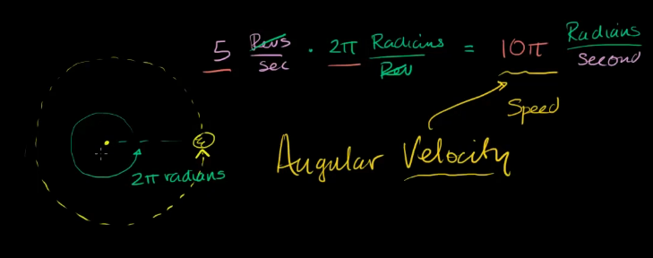

## 单元7：力矩与角动量

### 课程1：旋转运动
* 学习角位移、角速度和角加速度的含义，以及它们之间的关系。
* 假设一个物体绕圆周轨迹运动，想知道它绕圆心旋转的快慢程度如何与速度联系起来？
  假设每秒转5圈，即 5 Revs/sec，相应是每秒多少弧度？
  $$
  5 \frac{Revs}{sec}\cdot 2\pi\frac{Radius}{Rev} = 10\pi \frac{Radius}{sec}
  $$
  
  
  
* 角速度 (angular velocity)
  绕中心圆周运动的快慢程度称为角速度，因为它告诉我们角度变化的快慢程度。
  角速度是矢量，其大小称为角速率，其方向超屏幕外，不是很直观。
  这是一个伪矢量，以后还会讲到。
  该矢量的方向依赖于旋转方向，依照右手定则。
  角速度用$\omega$或$\Omega$表示。
  有几种考虑方式：将角速度考虑为角度变化量除以时间变化量：$\omega=\frac{\Delta \Theta}{\Delta t}$$，也可以从微积分层面考虑瞬时角速度$\omega=\frac{d\Theta}{d t}$。
  
* 角速度与物体实际速率的关系
  设圆的半径是$r米$，周长是$C=2\pi r米$，角速度是$\omega 弧度/秒$。
  每秒转多少圈呢？$ 角速度 = \omega \frac{Radians}{Second} \cdot \frac{1}{2\pi}\frac{Rev}{Radians} = \frac{\omega}{2\pi}\frac{Rev}{Second}$，所以
  再求出每秒转多少米？$速率 = \frac{\omega}{2\pi}\frac{Rev}{Second}\cdot 2\pi r\frac{Meter}{Rev}=\omega r\frac{Meter}{Second}$
  即，速率$v=\omega\cdot r$，用文字表述为：速度等于角速度大小乘以圆轨迹半径（Speed = Angular Velocity * Raidus)
  其他形式，$角速度\omega = 速率v / 半径r$
  

### 课程2：扭矩，力矩和角动量(torque, moments, angular momentum)

* 来自wiki，区分：力矩、转矩、转动力矩、扭矩、弯矩等。
  力矩（moment of force, moment)在物理学中，是作用力促使物体绕着转动轴或支点转动的趋向；也就是作用力使物体产生“转”、“扭”或“弯”效应的量度。
  使机械元件转动的力矩又称转矩（turning moment，moment of rotation）即转动力矩；
  在材料力学、土木工程和建筑学中，作用引起的结构或构件某一截面上的剪力所构成的力偶矩，称为扭矩（torsional moment，torque）；
  而作用引起的结构或构件某一截面上的正应力所构成的力矩，则称为弯矩（bending moment）。 
  力矩能够使物体改变其旋转运动。
  力矩 $\boldsymbol {\tau}$等于径向向量 $\mathbf {r} $与作用力 $\mathbf {F}$的叉积。 
  
* 什么是力矩(torque)？
  力矩是使物体围绕固定轴旋转的力的度量。正如力导致了物体在运动中获得线性加速度一样，力矩导致了物体获得角加速度。
  力矩是向量，力矩向量的方向取决于力相对于轴的方向。
  力矩可以是静态的也可以是动态的。
  * 静态力矩是指不产生角加速度的力矩。用力推一个紧闭的门，就是对门施加静态力矩，因为尽管施加了力，但门没有围绕轴旋转。以恒定速度蹬自行车的人也在施加静态力矩，因为没有加速。
  * 赛车从起点开始加速时，传动轴携带的是动态力矩，因为车轮必须要有角加速度才能让赛车在赛道上加速前进。
  描述力矩时使用的术语可能会造成混淆，工程上有时会使用扭矩(moment)或扭力(moment of force)代替力矩(torque)。力与转轴的距离有时也会叫做力臂(moment arm)。

* 如何计算力矩？
  由力 ‍$F$ 产生的力矩向量 ‍$\tau$ 的大小为：$\tau=F\cdot r\sin(\theta)$
  按照规定，力矩向量的方向由右手定则确定。右手四指指向力的方向，掌心面向转轴握拳，拇指的方向即为力矩的方向。

* 如何测量力矩？
  国际单位制 中，力矩的单位是牛·米。
  测量非转动系统中的静态力矩很简单，只要测量力的大小，再有力臂的长度就能直接计算了。而在转动系统中测量动态力矩要困难得多。常用的方法之一是通过测量金属转轴的应力或应变来间接计算力矩的大小。

* 力矩在转动运动学中扮演什么角色？
  在转动运动学中的力矩，与线性运动学中的力有着相同的角色。转动运动学中有一个跟牛顿第二定律（‍$F=ma$）相对应的等式：$\tau=I\alpha$。其中，$\alpha$是角加速度，$I$是转动惯量，转动惯量是转动系统的属性，取决于转动系统质量的分布。$I$越大，获得角加速度就越困难。

* 转动平衡是什么？
  转动平衡就是把牛顿第一定律的概念相应的应用到转动系统中。任何物体都要保持无转动的状态，直到有力矩使它转动为止。同样的，任何物体都要保持匀速转动状态，直到有力矩使它改变转动状态为止。
  在有多个力矩同时作用在一个可旋转的物体上这样的问题中，转动平衡的概念非常好用。这种问题的关键是净力矩，如果在这个物体上的净力矩为零，那么物体会保持转动平衡，不会获得角加速度。

* 怎样从力矩计算功率和能量？
  力矩、功率、能量三者很容易混淆，比如发动机的力矩，或者叫扭矩，有时会被错误的解释成“转动功率”。
  力矩和能量有着相同的量纲（即两者的基本单位相同），但力矩和能量并不是在描述相同的东西。区别在于力矩是只在转动系统中定义的向量，而能量则不是。
  在已知转速的情况下，由力矩可以计算出功率。实际上，发动机的马力并不是直接测量出来的，而是测量力矩和转速后通过计算得出。
  $P=\frac{力*距离}{时间}=\frac{F\cdot 2\pi r}{t} = \tau\frac{2\pi}{t}$
  此后，有两种形式
  * 当 $\omega$的单位是 $周数/秒$时，$P=2\pi \tau\omega$
  * 当 $\omega$的单位是 $rad/秒$时，$P=\tau\omega$
  
  和马力一样，汽车发动机的峰值扭矩也是一个很重要的常用指标。实际上，峰值扭矩跟通常所说的车的加速能力及载重能力有关，而马力（相对于重量）跟车的最高速度有关。
  在实际情况中，峰值扭矩和马力都随着转速的变化而变化。变化关系与发动机类型有关，并且通常是非线性的。
  
  
  
* 如何增大或减小力矩？
  经常需要增大或减小动力轴的力矩，以满足不同情况的需要。
  回忆一下，杠杆即可增大或减小一个力，代价是缩短或延长力的作用距离。
  同样，通过使用齿轮，即可增大或减小动力轴的力矩。力矩的增大伴随着转速的相应减小。
  两个齿轮的齿互相啮合可以被看作是一对杠杆的相互作用，
  
  
  
  内燃机驱动的车辆如果要获得好性能，必须安装变速齿轮。内燃机只能在高转速时很窄的范围内输出峰值扭矩，而变速齿轮能在任何转速下将足够的扭矩传递给车轮。
  自行车也需要齿轮组，因为人类蹬自行车的速度达不到常规速度下车轮的转速，所以需要齿轮将人蹬脚踏板的转速增大（当然，除非你骑的是那种前轮很大后轮很小的自行车）。
  蒸汽机车和电动车通常不需要变速齿轮，因为这两种动力源在低速时都可以输出高扭矩，并且在较大的速度范围内扭矩输出相对稳定。
  
* 什么是转动惯量(rotational inertia)？
  转动惯量是任何可以旋转的物体的属性。它是一个告诉我们改变物体围绕给定旋转轴的旋转速度是多么困难的标量。
  转动惯量在转动力学中的作用与线性力学中的质量作用相似。物体的转动惯量取决于它的质量以及该物体质量相对于旋转轴的分布。
  当质量离旋转轴越来越远时，改变系统的旋转速度变得越来越困难。直觉告诉我们，这是因为物体现在在圆周上（由于速度更高）带有更多的动量以及动量矢量正在更快地变化。这两种效果都取决于物体质量与轴的距离。
  符号是$I$。
  以系绳网球绕中心点旋转为例：

  

  质量为 ‍$m$ 的网球这样的单个物体，在距离旋转轴的半径为$r$处旋转，其转动惯量为
  $$
  I=mr^2
  $$
  因此，转动惯量的国际单位为 ‍$kg.m^2$。

* 转动惯量也通常被称为“质量惯性矩”，有时也被称为“质量二次矩”；这里的“二次”指的是转动惯量取决于瞬间臂长的平方。

* 转动惯量与牛顿第二定律有什么关系？
  牛顿第二定律将力与加速度联系在一起。在牛顿第二定律的转动版本中，转动惯量取代了质量。
  思考一个质量为 ‍$m$的物体连接到一个无质量杆的一端，杆的另一端是固定在一点的，以便系统可以围绕中央一点旋转。

  

  现在，我们开始转动该系统，方法是对质量施加一个切向力 ‍$F_T$（T可能是tangential的意思）。从牛顿第二定律可知，
  $$
  F_T = ma_T=m(r\alpha),
  $$
  其中，$\alpha$是角加速度。
  在转动力学中用力矩$\tau$代替力。当在等式两边同时乘以半径后给出了我们想要的表达式。
  $$
  F_Tr=m(r\alpha)r=mr^2\alpha,记作 \tau=I\alpha
  $$

* 练习1a
  能够产生 ‍$100Nm$恒定扭矩，最大旋转速度为 ‍$150rad/s$的电机，被连接到转动惯量为$0.1kgm^2$的飞轮上。当电机接通时，飞轮会有多大的角加速度？
  答：$\alpha=\tau/I=100/0.1=1000rad/s^2$，

* 练习1b
  如果从静止开始，飞轮需要多久才能达到稳定速度?
  答：根据旋转运动学
  到达最大旋转速度，即：$v=0+1/2\alpha t^2$，所以，$t=\sqrt{(2v)/\alpha}=\sqrt{(2*150)/1000}=0.54s$

* 如何计算转动惯量？
  机械系统通常是由连接在一起的许多物体或复杂的形状组成的。通过求和每个物体的转动惯量，可以计算出任何形状的物体相对任何轴的总转动惯量。
  $I=m_1r_1^2 + m_2r_2^2 + ... = \Sigma m_ir_i^2$
  如图，用两个不同的旋转轴显示的由几个物体组成的刚性系统
  
  
  
  上面左图中的物体，相对于给定旋转轴的转动惯量是：
  $$
  I = (1kg\cdot 1^2m^2) + (1kg\cdot 1.5^2m^2) + (1kg\cdot 0.75^2m^2) + (2kg\cdot 0.75^2m^2) = 4.9375 kg\cdot m^2
  $$
  
  上面右图中的物体，相对于给定旋转轴的转动惯量是：
  $$
  I = (1kg\cdot 0.5^2m^2) + (1kg\cdot 0.5^2m^2) + (1kg\cdot 0.5^2m^2) + (2kg\cdot 0.5^2m^2) = 1.25 kg\cdot m^2
  $$

* 如何找到复杂形状物体的转动惯量？
  对于更复杂的形状，通常需要使用微积分来求转动惯量。然而对于许多常见的几何形状，可以在教科书或其他来源中找到转动惯量的公式。这些公式通常给出围绕其质心旋转的物体的转动惯量（通常与物体形状对应质心）。
  例如:
  1. 半径为$r$的围绕中心轴旋转的实心圆柱体的转动惯量是 $I=\frac{1}{2}mr^2$
  2. 内经为$r_i$外径为$r_o$的空心援助体的转动惯量是$I=\frac{m(r_i^2+r_o^2)}{2}$
  3. 以下简单形状的公式
  
  
  
  复杂的形状通常可以被表示为简单形状的组合，已知这些简单形状的转动惯量公式。我们可以将这些转动惯量结合起来，找到复合物体的转动惯量。有时也可以通过将空隙视为具有负转动惯量的物体来计算具有空隙的均匀密度物体的转动惯量。
  在组合简单形状物体时，我们可能会遇到的问题是，公式告诉我们关于物体的质心的转动惯量，这不一定对应于我们的复合形状物体的转轴。我们可以用 平行轴定理 来解释这一点。
  平行轴定理让我们可以在知道物体的质心 ‍$c$ 周围的物体的转动惯量，质量 ‍$m$，点 ‍$o$ 和 ‍$c$ 之间的距离 ‍$d$ 时求该物体关于点 ‍$o$ 的转动惯量。
  $$
  I_o = I_c + md^2
  $$

* 练习
  如果图5所示的物体是通过焊接三个 ‍$10mm$厚的金属圆盘（每个圆盘的质量为 ‍$50kg$）焊接到一个质量是 ‍$100kg$的金属环上。如果围绕中心轴旋转（轴穿出页面），则它的转动惯量是多少？
  
  
  
  解答：
  圆环的转动惯量是 $I_1 = \frac{m(r_i^2+r_o^2)}{2} = \frac{100kg\cdot (0.75^2m^2+1.0^2m^2)}{2} =78.125 kg\cdot m^2$
  每个小圆盘相对于自身轴的转动惯量是 $I_2 = \frac{1}{2}mr^2 = 0.5\cdot 50kg\cdot 0.3^2m^2 = 2.25$
  根据平行轴定理，小圆盘的转动惯量是 $I_2'=I_2+md^2=I_2+50kg\cdot 0.875^2 m^2=40.53125$
  所以，总的转动惯量$I=I_1+3 I_2' = 78.125+3*40.53125=199.71875kg\cdot m^2$

* 在物理学中转动惯量还在哪里出现？
  在几乎所有涉及旋转运动物体的物理问题中，转动惯量都很重要。它被用于计算角动量，并（通过角动量守恒）帮助我们解释质量分布变化时旋转运动如何变化。转动惯量还是求旋转的飞轮中作为旋转动能储存的能量的必要条件。
  
* wiki 角动量
  在物理学中，角动量是与物体的位置向量和动量相关的物理量。对于某惯性参考系的原点 $\mathbf {O}$，物体的角动量是物体的位置向量和动量的叉积，通常写做 $ \mathbf {L}$。角动量是向量，且是一伪矢量。 
  $$\mathbf{L} = \mathbf{r}\times\mathbf{p}$$
  其中，$\mathbf{r}$表示物体的位置向量， $\mathbf {L}$表示角动量。$\mathbf {p}$表示动量。角动量$\mathbf {L}$又可写为： 
  $$\mathbf{L} =\mathbf{r} \times \mathbf{p} 
	  =\mathbf{r} \times (m\mathbf{v})
	  =\mathbf{r} \times ({\boldsymbol{\omega }}\times (m\mathbf {r}))
	  =mr^{2}{\boldsymbol {\omega }}
	  =I{\boldsymbol {\omega }}$$
  其中，$I$表示质点的转动惯量，$\omega$是角速度向量。
