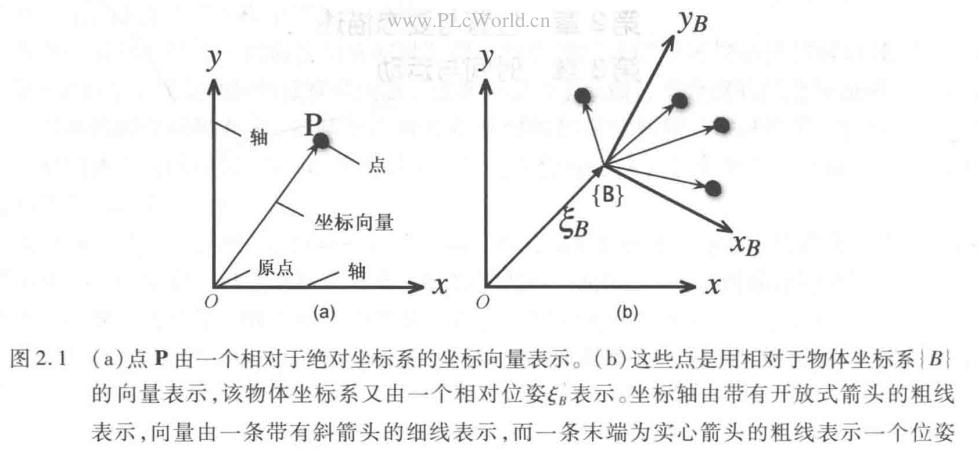
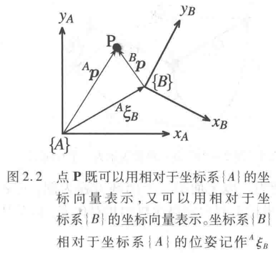
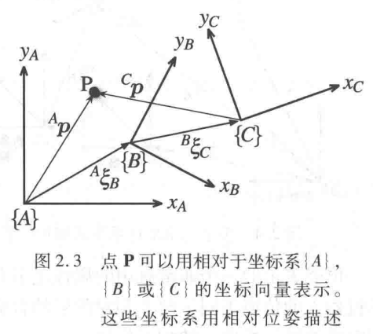

# RVC第2章，位置与姿态描述

## 引言
* 飞行控制系统的一个基本要求是能够表示物体在环境中的位置和方向，包括飞行器、摄像机、障碍物、设定的轨迹等。

* 空间中的点，可以被描述为一个坐标向量，也称为一个约束向量。如图2.1(a)所示。
  
  向量表示点相对于某个参考坐标系的位移。
  一个坐标系或笛卡尔坐标系统，是由一组正交轴构成的，这些轴相交于一个被称为原点的点。

* 我们更需要的是考虑组成物体的一组点。
  认为物体是刚性的，构成它的点相对于物体坐标系保持固定的相对位置。如图2.1(b)所示。
  表示物体位置和方向时不需要描述其上的每个点，而是用物体坐标系的位置和方向来描述。
  坐标系用形如$\{B\}$这样的记号，其坐标轴$x_B$和$y_B$采用坐标系的标记作为其下标。

* 坐标系的位置和方向总称为位姿，图形上表示为一组坐标轴。
  某个坐标系相对于一个参考坐标系的相对位姿用符号$\xi$表示。
  
  图2中显示了两个坐标系$\{A\}$和$\{B\}$，以及$\{B\}$相对于$\{A\}$的相对位姿${}^A\xi_B$，前面的上标表示参考坐标系，下标表示被描述的坐标系。
  也可认为${}^A\xi_B$描述了一组动作——对$\{A\}$施加平移和旋转使它转化为$\{B\}$。
  如果没有初始上标，默认位姿的变化是相对于用$O$表示的世界坐标系的。
  图2中的$\mathbf{P}$可用任何一个坐标系表示。并满足如下关系
  $$
  {}^A\boldsymbol{p}={}^A\xi_B\cdot {}^B\boldsymbol{p}
  $$
  等式右侧表示从$\{A\}$到$\{B\}$然后到$\mathbf{P}$的动作。
  运算符$\cdot$将一个向量转换为一个新的向量，它们是用不同的的坐标系来描述了相同的点。
  相对位姿的一个重要的特点是它们可以被合成或组合。
  
  
  
  图2.3为例，如果一个坐标系可以被其他坐标系用相对位姿秒寒素，则它们的关系可以记为
  $$
  {}^A\xi_C = {}^A\xi_B \oplus {}^B\xi_C
  $$
  用语言来表述为，$\{C\}$相对于$\{A\}$的位姿可以由$\{B\}$相对于$\{A\}$的位姿和$\{C\}$相对于$\{B\}$的位姿合成得到。
  
  
  
  

