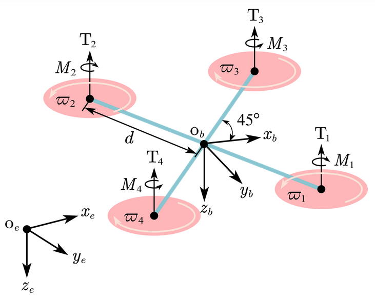
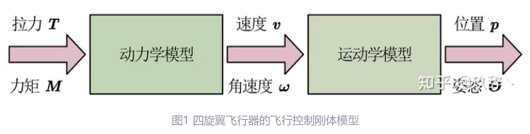
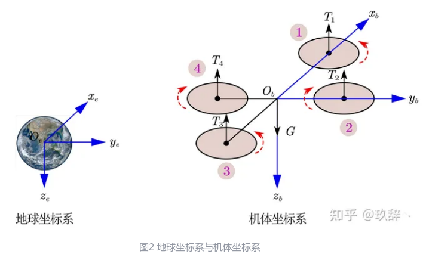
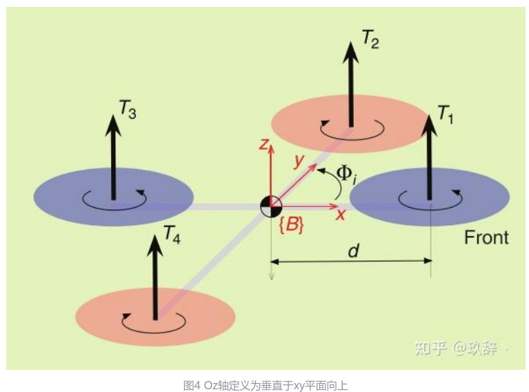

# 四旋翼飞行器建模

## 基本假设
* 为简化建模，对四旋翼飞行器进行以下假设
  * 四旋翼飞行器是均匀对称的刚体
  * 四旋翼飞行器的质量和转动惯量不发生改变
  * 四旋翼飞行器的几何中心与其重心重合
  * 四旋翼飞行器只受重力和螺旋桨拉力
  * 螺旋桨1、3为逆时针转动，螺旋桨2、4为顺时针转动（其实，这里还要假设4个桨的编号，X型等等）

## 动力学模型与运动学模型
* 建立四旋翼飞行器模型的目的
  分析四旋翼飞行器在受到外力、外力矩的情况下，其位置和姿态的变化情况。其中，
  * 动力学模型的输入为螺旋桨提供的拉力和力矩，输出为四旋翼的速度和角速度；
  * 运动学模型的输入为动力学模型的输出，即四旋翼的速度和角速度，输出为四旋翼的位置和姿态。
    其关系如下图所示：
  
    

## 地球坐标系与机体坐标系
* 本文将用到两个坐标系，即静坐标系——地球坐标系，以及动坐标系——机体坐标系。

* 地球坐标系取地球中心为坐标原点，其与地球固连。

* 机体坐标系取飞行器重心位置为坐标原点，其与四旋翼飞行器固连，轴方向为飞行器前进方向。

  
  
  图中，$O_ex_ey_ez_e$为地球坐标系，$O_bx_by_bz_b$为机体坐标系。
  两个坐标系都遵循右手法则。
  注：在有些论文资料中，将地球坐标系中的$O_ez_e$ 轴和机体坐标系中的 $O_bz_b$ 轴的方向定义为向上为正，与上图所示方向刚好相反，如下图所示。这并不影响建模过程，只影响动力学方程的正负号。
  
  

## 旋转矩阵
* 旋转矩阵的作用是将机体坐标系下表示的向量转变到地球坐标系下表示，向量的本质并不发生任何改变，只是改变了向量的表达形式。
* 旋转矩阵改变向量表达形式的目的在于
  * 在地球坐标系下表示四旋翼飞行器的位置和速度，有助于飞控手更好地确定飞行器的位置和飞行速度；
  * 在机体坐标系下表示四旋翼飞行器的拉力和力矩比较直观，且传感器的测量也是在机体坐标系下表示的。
  

## 牛顿-欧拉方程

## 四旋翼飞行器的动力学模型

## 四旋翼飞行器的运动学模型

## 四旋翼飞行器的控制刚体模型

