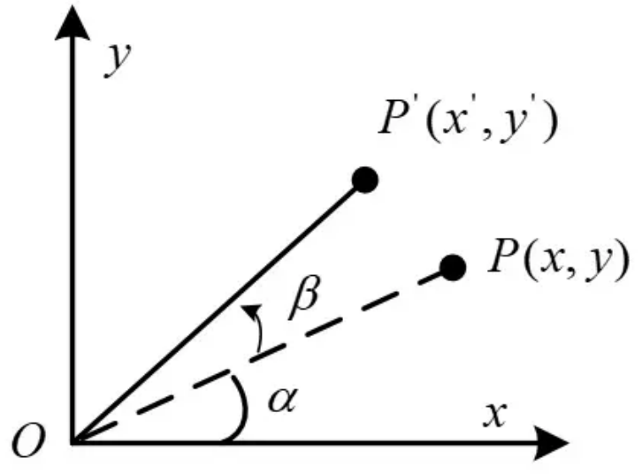

# 本文要解决的问题
* 理解旋转矩阵的产生和使用
* 理解矩阵左乘和右乘的区别
* 理解一些术语：绕静坐标系旋转与绕动坐标系旋转，内旋与外旋
* 姿态变换、坐标变换，二者都依赖于旋转矩阵，但用法上有细微的差别
* 以上所有内容都是形式化要解决的问题，让问题清晰化。
* 本文只考虑朝向表示问题，不考虑含有平移的位姿表示问题。

# 基本概念
对物理学和数学中的基本概念加以说明（这里并非严格区分）：
* 物理学概念
  * 点、线、面、体
  * 质点：为简化受力分析，用假想的这个点来代替物体。
  * 刚体(rigid-body）：不会发生形变的物体
  * 位置(position)：一个物体（质点，刚体）在空间中的定位，通常需要在坐标系中描述。
  * 朝向(orientation)：也称方向，一个物体（刚体）在空间中的方向，或者说相对于另一个物体所做的旋转，通常需要为物体附着一个坐标系来描述。
  * 位姿（pose）：坐标系的位置和方向的总称。
* 数学概念
  * 向量：在几何上和代数上有相互关联的含义。
    * 几何上，它是由起点指向终点的一个线段，具有大小和方向
    * 代数上，当建立了笛卡尔坐标系以后，向量是一个有序对，每个值是对应坐标轴基向量下的分量。方法是：将向量的起点移动到坐标系原点，向量在各个轴上的投影就是这些分量。
    * 自由向量：不关心起点的向量。
    * 在参考系下的向量：指定了参考系后，向量的起点和终点都被确定。
  * 矩阵：可看作是向量的向量，或者是一个对向量做变换的函数。
    * 矩阵乘以（列）向量：对向量的变换
    * （行）向量乘以矩阵：对向量的变换的另一种形式。
    * 矩阵乘以矩阵：变换作用的复合。
  * 坐标系：由一组起点相交且互相正交的基向量构成的整体，交点称为原点，各基向量分别称为坐标轴。
    * 常见的有：二维平面坐标系$Oxy$，三维空间坐标系$Oxyz$
    * 坐标系的用途：可用于描述物体的位置和朝向，也可用于表示两个物体的相对朝向。
    * 对于两个坐标系三维坐标系{s}和{b}，记$R_{sb}$表示把一个向量在{b}中的坐标变换到{s}中的坐标，则一个向量$v$在{s}和{b}下的坐标$v_s$和$v_b$满足如下关系：$v_s=R_{sb}v_b$。
  * 右手定则：用来确定三维空间中第三个轴的方向，或者确定一个旋转运动的旋转轴的方向。
    * 对于三维空间中的三个轴所在的单位向量$\hat{x},\hat{y},\hat{z}$，满足$\hat{x}\times\hat{y}=\hat{z},\ldots$。而右手定则是指，用“大拇指、食指，中指”这样的顺序分别绑定“x,y,z轴”，从而确定了任意第三个轴的方向。当然，有的学者会绑定“z,x,y轴”，这也没有问题，只要确保三根手指和三个轴的顺序都是一个轮换即可。
	* 对于旋转轴的方向，则是张开拇指握拳，四指卷曲的方向为旋转方向，大拇指指向的是旋转轴的正向。

# 旋转矩阵的推导
* 主要参考来源：[3维旋转矩阵推导与助记](https://zhuanlan.zhihu.com/p/183973440)
  
  

## 0. 引言
* 旋转矩阵的应用范围比较广，是姿态变换，坐标变换等的基础。本篇先介绍旋转矩阵的推导过程与助记方法。
* 旋转矩阵的旋转其实包含两种意思，一是在同一个坐标系下，向量的旋转；二是坐标系的旋转，使得同一向量在不同的坐标系下有不同的坐标。
* 旋转角的约定：在二维中以逆时针旋转为正方向，在三维中以右手定则来确定正方向。
* 旋转具有相对性，如果旋转一个向量$\theta$角，则相当于将坐标系旋转了$-\theta$角（注意，尽管二者相同，但是坐标系的旋转会引起更多的问题，需要注意是否有其他连接的坐标系）

## 1. 向量旋转
### 1.1 平面二维旋转
如下图，XY坐标系中，向量OP旋转β角度到了OP'的位置

根据三角函数关系，可以列出向量OP与OP'的坐标表示形式
$$
\begin{cases}
x = |OP|\cdot\cos(\alpha) \\
y = |OP|\cdot\sin(\alpha) 
\end{cases}
$$
$$
\begin{cases}
x' = |OP|\cdot\cos(\alpha+\beta) 
= |OP|\cdot(\cos\alpha\cdot\cos\beta - \sin\alpha\cdot\sin\beta)
= x\cdot\cos\beta - y\cdot\sin\beta\\
y' = |OP|\cdot\sin(\alpha+\beta) 
= |OP|\cdot(\cos\alpha\cdot\sin\beta + \sin\alpha\cdot\cos\beta)
= x\cdot\sin\beta + y\cdot\cos\beta\\
\end{cases}
$$
用矩阵形式重新表示为：
$$
\begin{bmatrix}x'\\y'\end{bmatrix}
=\begin{bmatrix}\cos\beta & -\sin\beta\\ \sin\beta & \cos\beta\end{bmatrix}
\begin{bmatrix}x\\y\end{bmatrix}
\triangleq R2\begin{bmatrix}x\\y\end{bmatrix}
$$

这就是二维旋转的基本形式，矩阵$R2$即二维旋转的旋转矩阵，坐标中的某一向量左乘该矩阵后，即得到这个向量旋转β角后的坐标。

若是反向旋转一个角度，推导过程类似：

$$
\begin{cases}
x = |OP|\cdot\cos(\alpha) \\
y = |OP|\cdot\sin(\alpha) 
\end{cases}
$$
$$
\begin{cases}
x' = |OP|\cdot\cos(\alpha-\beta) 
= |OP|\cdot(\cos\alpha\cdot\cos\beta + \sin\alpha\cdot\sin\beta)
= x\cdot\cos\beta + y\cdot\sin\beta\\
y' = |OP|\cdot\sin(\alpha-\beta) 
= |OP|\cdot(-\cos\alpha\cdot\sin\beta + \sin\alpha\cdot\cos\beta)
= x\cdot-\sin\beta + y\cdot\cos\beta\\
\end{cases}
$$
用矩阵形式重新表示为：
$$
\begin{bmatrix}x'\\y'\end{bmatrix}
=\begin{bmatrix}\cos\beta & \sin\beta\\ -\sin\beta & \cos\beta\end{bmatrix}
\begin{bmatrix}x\\y\end{bmatrix}
\triangleq R2'\begin{bmatrix}x\\y\end{bmatrix}
$$

最终得到的旋转矩阵$R2'$其实是正向旋转矩阵$R2$的逆矩阵，由于这个矩阵是正交阵，所以逆矩阵也是转置矩阵。
所以，二维旋转矩阵有如下重要的性质
$$
R2(-\theta)=R2^{-1}(\theta)=R2^T(\theta)
$$

另外，这里用的是列向量的形式，以及矩阵左乘列向量的形式，而如果是行向量左乘矩阵时，旋转矩阵要做转置。因为以下的命题成立
$$
\begin{bmatrix}x'\\y'\end{bmatrix}
=\begin{bmatrix}\cos\beta & -\sin\beta\\ \sin\beta & \cos\beta\end{bmatrix}
\begin{bmatrix}x\\y\end{bmatrix}
\Leftrightarrow
\begin{bmatrix}x' & y'\end{bmatrix}
=\begin{bmatrix}x & y\end{bmatrix}
\begin{bmatrix}\cos\beta & \sin\beta\\ -\sin\beta & \cos\beta\end{bmatrix}
$$

### 1.2 三维旋转

三维旋转可借助二维旋转来理解，由于三维空间中可以任意轴旋转，为方便分析与使用，先只考虑绕X、Y、Z轴的旋转。

* 绕Z轴
  参照上面的图，添加一个Z轴，则上面的二维旋转实际上就是绕Z轴的三维旋转。
  我这里用颜色区分了不同的轴

  
  
  照搬上面的推导公式，并添加Z坐标的变换关系(实际是没有变)如下
$$
\begin{cases}
x' = x\cdot\cos\beta - y\cdot\sin\beta\\
y' = x\cdot\sin\beta + y\cdot\cos\beta\\
z' = z
\end{cases}
$$
  然后改写成矩阵形式
$$
\begin{bmatrix}x'\\y'\\z'\end{bmatrix}
=\begin{bmatrix}\cos\beta & -\sin\beta & 0\\\sin\beta & \cos\beta & 0\\0 & 0 & 1\end{bmatrix}
\begin{bmatrix}x\\y\\z\end{bmatrix}
\triangleq R3z\begin{bmatrix}x\\y\\z\end{bmatrix}
$$

* 绕Y轴，绕X轴
  类似的，
  
  
  
  同理可得，
$$
\begin{bmatrix}x'\\y'\\z'\end{bmatrix}
=\begin{bmatrix}\cos\beta & 0 & \sin\beta\\0 & 1 & 0\\-\sin\beta & 0 & \cos\beta\end{bmatrix}
\begin{bmatrix}x\\y\\z\end{bmatrix}
\triangleq R3y\begin{bmatrix}x\\y\\z\end{bmatrix}
$$
$$
\begin{bmatrix}x'\\y'\\z'\end{bmatrix}
=\begin{bmatrix}1 & 0 & 0\\0 & \cos\beta & -\sin\beta\\0 & \sin\beta & \cos\beta\end{bmatrix}
\begin{bmatrix}x\\y\\z\end{bmatrix}
\triangleq R3x\begin{bmatrix}x\\y\\z\end{bmatrix}
$$

## 2. 坐标系旋转
### 2.1 平面二维旋转
如下图，xy坐标系中，有一向量OP，其坐标可表示为(x，y)，该向量与X轴夹角为α。然后，坐标系绕原点逆时旋转了β角度，形成新的坐标系x’y’，此时OP在新的坐标系中的坐标表示为(x，y)。

根据几何关系，可以得到如下推导
$$
\begin{cases}
x = |OP|\cdot\cos(\alpha) \\
y = |OP|\cdot\sin(\alpha) 
\end{cases}
$$
$$
\begin{cases}
x' = |OP|\cdot\cos(\alpha-\beta) 
= |OP|\cdot(\cos\alpha\cdot\cos\beta + \sin\alpha\cdot\sin\beta)
= x\cdot\cos\beta + y\cdot\sin\beta\\
y' = |OP|\cdot\sin(\alpha-\beta) 
= |OP|\cdot(-\cos\alpha\cdot\sin\beta + \sin\alpha\cdot\cos\beta)
= x\cdot-\sin\beta + y\cdot\cos\beta\\
\end{cases}
$$
用矩阵形式重新表示为：
$$
\begin{bmatrix}x'\\y'\end{bmatrix}
=\begin{bmatrix}\cos\beta & \sin\beta\\ -\sin\beta & \cos\beta\end{bmatrix}
\begin{bmatrix}x\\y\end{bmatrix}
\triangleq R2'\begin{bmatrix}x\\y\end{bmatrix}
$$

可以看出，这里的所有数学公式与上面向量旋转一节中对二维旋转使用负角度的情形一模一样。
只是换了一个不同的图形来解释。
也就是说，坐标系旋转的旋转矩阵与上面向量旋转的旋转矩阵正好是转置的关系(也是逆矩阵关系)，因为这两种旋转本质上是相对运动，互为逆过程。

### 2.2 三维旋转
同理可得，在三维中坐标系绕X，Y，Z轴旋转的基本旋转矩阵恰好是上面的$R3x,R3y,R3z$的转置。

## 3. 如何使用这些旋转矩阵？

### 3.1 在二维旋转中
* 在一个二维坐标系{A}下，任一向量$\mathbf{v}_1$转动$\theta$后到达向量$\mathbf{v}_2$，向量$\mathbf{v}_2$又旋转$\phi$后到达向量$\mathbf{v}_3$，记$\mathbf{v}_1$,$\mathbf{v}_2$和$\mathbf{v}_3$关于{A}的坐标为$\mathbf{p}_1=\begin{bmatrix}v_{1_x}\\v_{1_y}\end{bmatrix}$,$\mathbf{p}_2=\begin{bmatrix}v_{2_x}\\v_{2_y}\end{bmatrix}$和$\mathbf{p}_3=\begin{bmatrix}v_{3_x}\\v_{3_y}\end{bmatrix}$，记这两个变换相应的旋转矩阵为$\mathbf{R}\triangleq \mathbf{R2}(\theta)$和$\mathbf{S}\triangleq \mathbf{R2}(\phi)$，则
  $$
  \begin{cases}
  \mathbf{p}_2=\mathbf{R}\mathbf{p}_1,\quad
  \mathbf{p}_1=\mathbf{R}^{\mathrm{T}}\mathbf{p}_2,\\
  \mathbf{p}_3=\mathbf{S}\mathbf{p}_2,\quad
  \mathbf{p}_2=\mathbf{S}^{\mathrm{T}}\mathbf{p}_3,\\
  \end{cases}
  $$
  从而，
  $$
  \begin{cases}
  \mathbf{p}_3=\mathbf{S}\mathbf{R}\mathbf{p}_1,\\
  \mathbf{p}_1=\mathbf{R}^{\mathrm{T}}\mathbf{S}^{\mathrm{T}}\mathbf{p}_3
	  =\mathbf{R}^{\mathrm{T}}\mathbf{S}^{\mathrm{T}}\mathbf{p}_3
  ,\\
  \end{cases}
  $$
  这说明，同一个二维坐标系下，向量$\mathbf{v}_1$经过$\theta_1,\ldots,\theta_n$多次旋转后到达$\mathbf{v}_{n+1}$，记$\mathbf{v}_{i}$的坐标$\mathbf{p}_{i}$，则
  $$
  \mathbf{p}_{n+1}=\mathbf{R}_n\ldots\mathbf{R}_1\mathbf{p}_1,\qquad
  \mathbf{p}_1=\mathbf{R}_1^{\mathrm{T}}\ldots\mathbf{R}_{n+1}^{\mathrm{T}}\mathbf{p}_{n+1},
  $$
  其中，$\mathbf{R}_i=\mathbf{R2}(\theta_i)$。
  
* 两个个原点重合的二维坐标系{A}和{B}，坐标系{B}相对于{A}旋转了$\alpha$角，任意向量$v$在三个坐标系下的坐标是${}^Av$和${}^Bv$，则
$$
\begin{cases}
v_B = R2(\alpha) v_A,\\
v_C = R2(\beta) v_B,\\
v_C = R2(\beta)R2(\alpha) v_A\\
\end{cases}
$$
$$
\begin{cases}
v_A = R2(-\alpha) v_B = R2^T(\alpha) v_B ,\\
v_B = R2(-\beta) v_C = R2^T(\beta) v_C,\\
v_A = R2(-\alpha)R2(-\beta) v_C = R2^T(\alpha)R2^T(\beta) v_C,
\end{cases}
$$

记 $R_i^j\triangleq R2(\alpha)$ 表示{i}相对于{j}旋转了$\theta$角（也称{i}关于{j}的相对位姿）。
例如，记$R_A^B\triangleq R2(\alpha)$ 表示{B}关于{A}的相对位姿。则：
$$
v_B = R_A^B v_A,\quad v_C = R_B^C v_B,\quad v_A = R_B^A R_C^B v_C,
$$

* 3个原点重合的二维坐标系{A},{B}和{C}，坐标系{B}相对于{A}旋转了$\alpha$角，{C}相对于{B}旋转了$\beta$角，任意向量$v$在三个坐标系下的坐标是$v_A,v_B,v_C$，则
$$
\begin{cases}
v_B = R2(\alpha) v_A,\\
v_C = R2(\beta) v_B,\\
v_C = R2(\beta)R2(\alpha) v_A\\
\end{cases}
$$
$$
\begin{cases}
v_A = R2(-\alpha) v_B = R2^T(\alpha) v_B ,\\
v_B = R2(-\beta) v_C = R2^T(\beta) v_C,\\
v_A = R2(-\alpha)R2(-\beta) v_C = R2^T(\alpha)R2^T(\beta) v_C,
\end{cases}
$$

记 $R_i^j\triangleq R2(\alpha)$ 表示{i}相对于{j}旋转了$\theta$角（也称{i}关于{j}的相对位姿）。
例如，记$R_A^B\triangleq R2(\alpha)$ 表示{B}关于{A}的相对位姿。则：
$$
v_B = R_A^B v_A,\quad v_C = R_B^C v_B,\quad v_A = R_B^A R_C^B v_C,
$$
<!-- v_B = R2(\alpha) v_A,\quad v_C = R2(\beta) v_B, -->
	

# 来自网络的补充内容
## [坐标变换最通俗易懂的解释（推导+图解）](https://blog.csdn.net/weixin_45590473/article/details/122848202)
* 旋转矩阵的第1行是新系中各个轴在旧系中x轴所在基向量上的投影，第2行是...y，第3行是...z。

## [旋转矩阵及左右乘的意义](https://blog.csdn.net/weixin_45632220/article/details/117735223)
* 旋转矩阵的两个功能：坐标变换，向量旋转（对三个基向量旋转也就是坐标系的旋转）。
## 关于“矩阵左乘、右乘”
* 在图形学领域，DirectX使用行向量乘以矩阵，而OpenGL使用矩阵乘以列向量。
* 也称为预乘和后乘，即 pred-multiplication 和 post-multiplication。
* 习惯上，向量用列向量表示，对一个向量做空间的变换，就是用矩阵左乘列向量，写作$Ax$，这样符合我们初次学代数时“把x写在后面”的习惯。
* 喜欢用行向量乘以矩阵的几个可能的理由：
  * 有人认为行向量是在内存中连续存储的，计算效率优于列向量
  * 排版的时候可以把向量$x=(1,2,3)$写成一行，然而这种做法要和矩阵乘以向量等价时，就要$xB$（其中，$B=A^T$）。
## 左乘、右乘这两个概念需要规范
* 左乘还是右乘似乎没有统一的或者说规范的说法。我认为需要有一个规范的说法。在没有找到规范之前，建议把AB读作：左A乘B、A乘右B、B乘左A，右B乘A。
  我觉得应该读成：A乘以B。
  如果是矩阵和向量，则读成：行向量乘以矩阵，矩阵乘以列向量。
## 常听到的一些说法
* 基于全局坐标系的旋转变换左乘旋转矩阵，基于自身坐标系的旋转变换右乘旋转矩阵。

## [旋转矩阵为何左乘是相对固定坐标系，右乘是相对当前坐标系？ - 七秒鱼的回答 - 知乎](https://www.zhihu.com/question/407150749/answer/2354372507)
* 定义旋转矩阵
  $$
  R_A^B=\begin{bmatrix}
  \mathbf{x}_A^B & \mathbf{y}_A^B & \mathbf{z}_A^B
  \end{bmatrix}
  =\begin{bmatrix}
  \mathbf{x}_B^T\mathbf{x}_A & \mathbf{x}_B^T\mathbf{y}_A & \mathbf{x}_B^T\mathbf{z}_A \\
  \mathbf{y}_B^T\mathbf{x}_A & \mathbf{y}_B^T\mathbf{y}_A & \mathbf{y}_B^T\mathbf{z}_A \\
  \mathbf{z}_B^T\mathbf{x}_A & \mathbf{z}_B^T\mathbf{y}_A & \mathbf{z}_B^T\mathbf{z}_A \\
  \end{bmatrix}
  $$
  其中，$\mathbf{x}_A^B, \mathbf{y}_A^B, \mathbf{z}_A^B$分别表示坐标系{A}的XYZ三个坐标轴基向量在坐标系{B}的XYZ坐标轴基向量上的投影。
  因此，旋转矩阵$R_A^B$可用来表示坐标系{A}与坐标系{B}的相对位置关系，即{A}在{B}中的描述。
* 角标对消法则
  $$
  \mathbf{x}_A^C = R_B^C\mathbf{x}_A^B
  $$
  即，向量$\mathbf{x}_A$（表示坐标轴{A}的X轴的向量）在{B}中的描述$\mathbf{x}_A^B$，左乘以{B}在{C}中的描述$R_B^C$，得到该向量在{C}中的描述$\mathbf{x}_A^C$。
  同理，Y，Z轴也能这样消去。于是
  $$
  \begin{bmatrix}\mathbf{x}_A^C & \mathbf{y}_A^C & \mathbf{z}_A^C\end{bmatrix}
  = R_B^C \begin{bmatrix}\mathbf{x}_A^B & \mathbf{y}_A^B & \mathbf{z}_A^B\end{bmatrix}
  $$
  即，
  $$
  R_A^C = R_B^C R_A^B
  $$

## [旋转矩阵为何左乘是相对固定坐标系，右乘是相对当前坐标系？ - nicekwell的回答 - 知乎](https://www.zhihu.com/question/407150749/answer/2354982075)
* 对于两个变换的叠加：$M_2M_1$ 表示先进行$M_1$ 变换，再进行$M_2$ 变换，这里 $M_1$和$M_2$ 都是自然基坐标系下。
* 如果$M_2$变换是在$M_1$ 坐标系基础上进行的，那么根据相似矩阵先把$M_2$转换成自然基坐标系下：$M_1M_2M_1^{-1}$，然后把两个变换叠加就是：$(M_1M_2M_1^{-1})M_1=$M_1M_2$。
* 有趣的结果是，如果每个变换都是在上个变换基础上进行的，那么只要把矩阵顺序反过来即可。
* 结论是
  * 所有变换都在自然基下：$M_4M_3M_2M_1$。
  * 每个变换在前一个变换后的坐标系下：$M_1M_2M_3M_4$。
* 我个人在在三维下的推广
  * 外旋：绕固定坐标系，也就是说在自然基下。
  * 内旋：绕动坐标系，那么每次都是在前一个的变换下进行。
