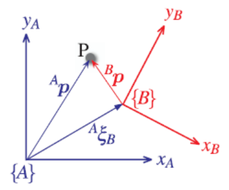
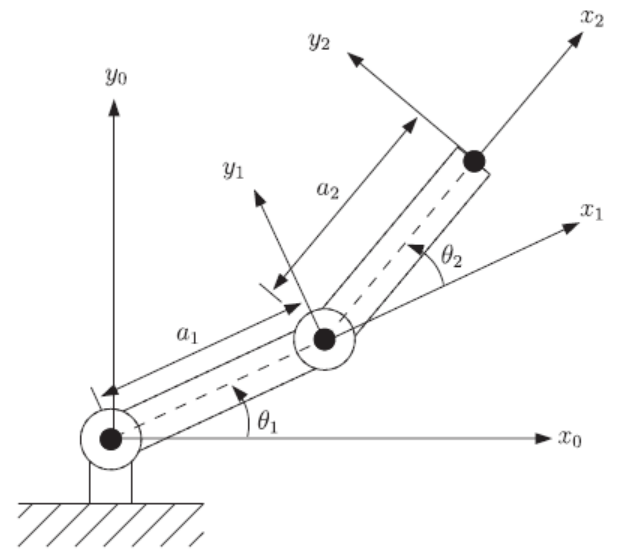

# 易混术语的辨析

## configuration(配置) of a robt 和 pose(位姿) of a robot
* 关于"pose"的一个最清楚的定义来自Peter Corke的 RVC 中：
  一个坐标系的位置和朝向被称为它的位姿(pose)，并以图形方式显示为一组坐标轴。一个坐标系相对于一个参考坐标系的“相对位姿”用符号$\xi$表示。
  以下是来自RVC的图2.2:
  
  点P可通过相对于坐标系{A}或{B}的坐标向量来描述。{B}相对于{A}的位姿是${}^A\xi_B$。
* 机器人中的配置(configuration)是一组标量参数，指定机器人所有点相对于某个固定坐标系的位置。
  这可以表示为位置和朝向的一个向量，例如 $q = (x,y,\theta)$ 或 $q = (x,y,z,\alpha,\beta,\gamma)$。
  所有可能配置的集合是“配置空间(configuration space”或“C 空间 (C-space)”。
  如果我们考虑具有 2 个旋转关节（2R 臂）的二连杆平面机械手，如下所示（取自 RVC 中的图 7.3）：
  
  配置可以仅用两个关节角度 θ1 和 θ2 来表示，而配置空间是关节角度 θ1 和 θ2 所有可能组合的集合。
  请注意，配置不一定是唯一的。对于该机器人，有两种可能的配置会导致相同的末端执行器位置，但末端执行器在每种情况下都会具有不同的方向。

## 
	
	
	

