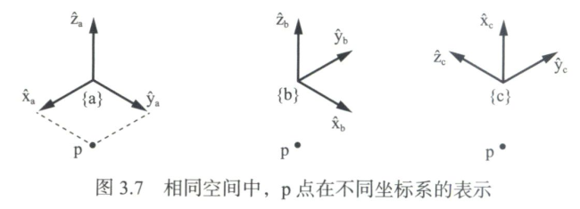

# 刚体运动 Rigid-Body Motions
参考：
[现代机器人学：机构、规划与控制]
[Modern Robotis: Mechanics, Planning, and Control](https://hades.mech.northwestern.edu/index.php/Modern_Robotics)

## 引言
* 描述刚体在三维物理空间中的位置和姿态（简称位姿）至少需要6个参数。
  通过在刚体上附着参考坐标系，建立一种系统的方法来描述刚体的位姿。该坐标系相对固定参考坐标系的配置可以写成4×4矩阵的形式。
  该矩阵可用于：
  1. 对向量或坐标系进行平移和旋转;
  2. 将向量或坐标系从一个坐标系变换到另一个坐标系。
  这些操作通过简单的线性代数运算即可实现。
  
* 刚体速度可以简单地表示成$\mathbb{R}^6$中的—个向量，其中包括3个角速度和3个线速度,这些速度一起被称为空间速度（spatial velocity）或运动旋量（twist）。

* 所有刚体配置都可以通过螺旋运动来实现，这一结论衍生出一种6个参数的配置表示方法，被称为指数坐标（exponential coordinate）。这6个参数应同时包括描述螺旋轴方向的参数和表明螺旋运动幅值的参数。

* 力矩（扭矩）和力也可以—起整合成被称为空间力（spatial force）或力旋量（wrench）的一个六维向量。

## 向量与参考坐标系
* 自由向量（free vector）是—种只具有大小和方向的几何量。
  称之为自由向量是因为它无须附着在任何固定位置，只关注其大小和方向。
  线速度就可以看作是一个自由向量。
  自由向量用正体小写字母表示，如 v。
  
* 如果已经选择了参考坐标系和v所在空间的长度比例,那么这个自由向量可以移动到这样的位置:箭头的底部与原点重合但不改变方向。该自由向量v可以用参考坐标系中的坐标表示。
  用斜体字母表示向量，$v\in \mathbf{R}^n$，其中$v$表示在参考坐标系中箭头的“头部”坐标。选择不同的参考坐标系和单位长度, γ将会改变’但是对应的自由向量v不变。
  换句话说，我们说v是无坐标的（coordinate free）;它指代基础空间中的一个个物理量，而无论我们如何表示它。然而$v$是v的一个与坐标系的选取相关的表示。
  
* 物理空间中的p点也可以表示成向量的形式。给定物理空间内的参考坐标系和长度比例，p点就可以看成是从参考坐标系原点到p点的一个向量，用斜体符号表示成$p\in\mathbb{R}^n$。

  

* 长度单位总是事先设定好的，而对参考坐标系的位置与方向需要进行不同的选择。
  参考坐标系可以放在空间的任何位置，每个参考坐标系都有其特定的物理意义。
  我们总是要定义一个相对静止的固定坐标系（fixed frame），即空间坐标系（space frame），记作｛s｝。
  我们也经常至少选择一个附着在某—运动刚体上的随动坐标系，这个坐标系称为物体坐标系（body frame），记作｛b}，它是一个在任一瞬时都与刚体随动坐标系相重合的静止坐标系。

* 所有坐标系都遵循右于定则，如下图

  
  
  注意，上面的x,y,z轴正向分别是：食指，中指，大拇指。
  
  在全权老师的书上介绍右手定则时，如下
  
  
  
  注意，上面的x,y,z轴正向分别是：拇指，食指，中指。
  
  虽然上面两种做法在用不同手指指示坐标轴正向，但一个相同点是x,y,z轴所用的三个手指的顺序是：{拇指,食指,中指}或它的一个循环移位的顺序。把握这一点即可。
  坐标系遵循右手定则的数学描述是：单位坐标轴$(\hat{\mathrm{x}},\hat{\mathrm{y}},\hat{\mathrm{z}})$总是满足$\hat{\mathrm{x}}\times\hat{\mathrm{y}}=\hat{\mathrm{z}}$。

## 3.1 平面内的刚体运动
* 考虑如下图所示的平面刚体（灰色表示），其运动限定在平面内。假定用｛s｝表示固定坐标系，$\hat{\mathrm{x}}_s$和$\hat{\mathrm{y}}_s$为其中两个坐标轴的单位向量。与之类似，我们用另一个坐标系附着在该刚体上，其单位坐标轴用$\hat{\mathrm{x}}_b$和$\hat{\mathrm{y}}_b$表示。由于该坐标系随刚体一起运动，因此又称之为物体坐标系，并用｛b｝来表示。

  
* 为描述平面刚体的配置，只需要给出物体坐标系相对固定坐标系的位置和朝向。
  物体坐标系的原点p可以在固定坐标系｛s｝中表示:
  $p = p_x\hat{\mathrm{x}}_s + p_y\hat{\mathrm{y}}_s$
  你可能已经习惯将向量$p$写成简单的形式$p=(p_x, p_y)$，如果不会产生有关坐标系歧义的话，这种表示无可厚非，但该式则清晰地反映出了向量p所在的参考坐标系。
  描述物体坐标系｛b｝相对｛s｝的朝向的最简单方法是给定转角$\theta$。还可采用另外一种方法，即给出物体坐标系｛b｝中两个单位坐标轴相对固定坐标系｛s｝中两个单位坐标轴的方向，即
  $$\hat{\mathrm{x}}_b=\cos\theta\hat{\mathrm{x}}_s+\sin\theta\hat{\mathrm{y}}_s$$
  $$\hat{\mathrm{y}}_b=-\sin\theta\hat{\mathrm{x}}_s+\cos\theta\hat{\mathrm{y}}_s$$
  乍—看，这种表示对描述物体坐标系的姿态相当不直观。不过，当假想一个刚体在三维空间内做任意运动时，用单个转角$\theta$就无法描述物体坐标系的姿态了，而实际上需要3个转角参数，接下来的难点在于如何定义这3个参数。相反，若用参考坐标系下的坐标轴表示物体坐标系下的坐标轴，如上面对平面刚体描述的那样，就变得十分直观了。
  假设以下表示均基于固定坐标系{s}。点p可以写成列向量$p\in\mathbb{R}^2$的形式，即
  $$p=\begin{bmatrix}p_x\\p_y\end{bmatrix}$$
  单位向量$\hat{\mathrm{x}}_b$和$\hat{\mathrm{y}}_b$也可写成列向量的形式，并组成如下的$2\times 2$矩阵形式，即
  $$P=\begin{bmatrix}\hat{\mathrm{x}}_b&\hat{\mathrm{y}}_b\end{bmatrix}
     =\begin{bmatrix}\cos\theta&-\sin\theta\\\sin\theta&\cos\theta\end{bmatrix}$$
  矩阵$P$表示的就是—个旋转矩阵。虽然$P$由4个元素组成，但存在3个约束方程（$P$的每列必须为单位向量，且两个列向量相互正交），这样只剩下—个单自由度的参数$\theta$。将以上两式合起来，组成$(P,p)$，就可以完全来描述{b}相对{s}的位姿。

* 现在再来看下图所示的含3个坐标系的情况。
  
  

  仿照上述方法,坐标系｛c｝相对｛S｝用 $(R,r)$来表示，这样，我们有
  $$r=\begin{bmatrix}r_x\\r_y\end{bmatrix},\quad
    R=\begin{bmatrix}\cos\phi&-\sin\phi\\\sin\phi&\cos\phi\end{bmatrix}$$
  
  同样，我们也可以写出坐标系｛c｝相对｛b｝的表达。令$q$为坐标系｛b｝原点到坐标系｛c｝原点的向量，并在｛b｝中描述; 再令$Q$为坐标系｛c｝相对坐标系｛b｝的姿态，这样，坐标系｛c｝相对｛b｝就可用$(Q,q)$来表示，其中
  $$q=\begin{bmatrix}q_x\\q_y\end{bmatrix},\quad
    Q=\begin{bmatrix}\cos\psi&-\sin\psi\\\sin\psi&\cos\psi\end{bmatrix}$$

* 如果我们知道$(Q,q)$（｛c｝相对｛b｝的配置）和$(P,p)$（｛b｝相对｛s｝的位形），即可以通过下式计算出｛c｝相对｛S｝的位形:
  $$R＝PQ（将Q转换到｛s｝系中）$$
  $$r = Pq＋p（将q转换到｛s｝系中，再与p求向量和）$$
  由此可以看出，$(P,p)$不仅可以用来表示｛b｝相对｛s｝的位形，还可以用来将｛b｝中点的坐标转换到｛S｝中（我个人的理解，即$R,r$的作用）。

* 在三维中，如图所示
  
  
  
  假定定选定了长度单位，以及同定坐标系｛s｝和物体坐标系｛b｝。分别定义固定坐标系｛s｝的3个单位坐标轴$(\hat{\mathrm{x}}_s,\hat{\mathrm{y}}_s,\hat{\mathrm{z}}_s)$ 和物体坐标系｛b｝的3个单位坐标轴$(\hat{\mathrm{x}}_b,\hat{\mathrm{y}}_b,\hat{\mathrm{z}}_b)$，令$p$为坐标系｛s｝原点到坐标系｛b｝原点的向量，并在｛s｝中描述，由此可得
  $$p＝p_1\hat{\mathrm{x}}_s + p_2\hat{\mathrm{y}}_s + p_3\hat{\mathrm{z}}_s$$
  相应地,物体坐标系的3个单位坐标轴可表示成
  $$\hat{\mathrm{x}}_b＝r_{11}\hat{\mathrm{x}}_s+r_{21}\hat{\mathrm{y}}_s+r_{31}\hat{\mathrm{z}}_s$$
  $$\hat{\mathrm{y}}_b＝r_{12}\hat{\mathrm{x}}_s+r_{221}\hat{\mathrm{y}}_s+r_{32}\hat{\mathrm{z}}_s$$
  $$\hat{\mathrm{z}}_b＝r_{13}\hat{\mathrm{x}}_s+r_{23}\hat{\mathrm{y}}_s+r_{33}\hat{\mathrm{z}}_s$$
  定义$p\in\mathbb{R}^3,R\in\mathbb{R}^{3\times3}$，即
  $$p=\begin{bmatrix}p_1\\p_2\\p_3\end{bmatrix},\quad
    R=\begin{bmatrix}\hat{\mathrm{x}}_b&\hat{\mathrm{y}}_b&\hat{\mathrm{z}}_b\end{bmatrix}
	 =\begin{bmatrix}r_{11}&r_{12}&r_{13}\\
	 r_{21}&r_{22}&r_{23}\\r_{31}&r_{32}&r_{33}\\\end{bmatrix},$$
  此处，$(R,p)$中的l2个参数完全可以描述刚体相对固定坐标系下的位姿和朝向。
  由于刚体的姿态最多为3个自由度，因此$R$中的9个参数只有3个是独立的。其中一种三参数的旋转矩阵表示是指数坐标，可以通过旋转轴和相应旋转角来定义。在附录B中还可以找到其他几种常见的姿态表示方法，如欧拉角法、RPY角法、凯莱-罗德里格斯参数法以及单位四元数法等。

## 3.2 旋转与角速度
### 3.2.1 旋转矩阵
* 旋转矩阵$R$中的9个参数只有3个是独立的。下面给出6个约束方程。
  注意， $R$中的3个列向量分别对应物体坐标系的3个单位坐标轴，即$(\hat{\mathrm{x}}_b,\hat{\mathrm{y}}_b,\hat{\mathrm{z}}_b)$。因此：
  * 正则条件（the unit norm condition)
  * 正交条件 (the orthogonality condition)
  这6个约束方程还可以写成更紧凑的矩阵表达形式，即：$R^TR=I$。
  
* 坐标系中的3个坐标轴始终遵循右手定则（即$\hat{\mathrm{x}}_b\times\hat{\mathrm{y}}_b=\hat{\mathrm{z}}_b$)，而不是左手定则（即$\hat{\mathrm{x}}_b\times\hat{\mathrm{y}}_b=-\hat{\mathrm{z}}_b$。
  上述6个约束方程并未区分左手坐标系和右手坐标系。
  回忆求矩阵$M$对应行列式，假设$M$的3个列向量分别为$a,b,c$，其行列式值为
  $$\det M=a^T(b\times c)=b^T(c\times a)=c^T(a\times b)$$
  将$R$的列向量值代入，可得约束方程$\det R=1$。
  注意，如果是左手坐标系，则$\det R=-1$。
  总之，增加额外的约束方程$\det R=1$是为了保证右手坐标系的条件。

* $3\times 3$转矩阵组成的集合称为特殊正交群（special orthogonal group）$SO(3)$,以下给出其正式定义。

* 定义「特殊正交群$SO(3)$」：也称旋转矩阵群，是所有$3\times3$实数矩阵$R$的集合，且满足：$R^TR=I$；$\det R=1$。
  $SO(2)$中的各元素表示空间姿态。

* 定义「特殊正交群$SO(2)$」：是所有$2\times2$实数矩阵$R$的集合，且满足：$R^TR=I$；$\det R=1$。
  $SO(2)$中的各元素表示平面姿态。

* 由定义，每个$R\in SO(2)$都可以写成
  $$R=\begin{bmatrix}r_{11}&r_{12}\\r_{21}&r_{22}\end{bmatrix}
     =\begin{bmatrix}\cos\theta&-\sin\theta\\\sin\theta&\cos\theta\end{bmatrix}$$
  其中，$\theta\in[0,2\pi)$。

* 旋转矩阵的特性
  * 群特性：乘法封闭性，结合律，么元律，可逆性。
  * 旋转矩阵作用于某一向量不改变该向量的长度。

* 旋转矩阵的应用
  * 表示姿态
  * 进行坐标系转换，通过向量或坐标系来表示;
  * 对向量或坐标系进行旋转变换。
  对于第一个用途，$R$本身就表示坐标系；对于第二、三个用途，$R$为作用在向量或坐标系上的算子（变换参考坐标系或者旋转坐标系）。

* 为更好地解释上述用途，下图给出了图形化描述。

  
  用3个不同的坐标系{a}、{b}、{c}表示同一空间。这些坐标系具有相同的坐标原点，由于这里只表示姿态，为使描述更为清晰，图中将同一空间画了3次，包括该空间内的p点。注意，固定坐标系｛s｝并没有在图中标出，事实上它与｛a｝重合。这样，3个坐标系相对｛s｝的姿态可以写成
  $$
  R_a=\begin{bmatrix}1&0&0\\0&1&0\\0&0&1\end{bmatrix},quad
  R_b=\begin{bmatrix}0&-1&0\\1&0&0\\0&0&1\end{bmatrix},quad
  R_c=\begin{bmatrix}0&0&1\\-1&0&0\\0&-1&0\end{bmatrix},
  $$
  $p$点在这些坐标系中的位置可相应地写成
  $$
  p_a=\begin{bmatrix}1\\1\\0\end{bmatrix},quad
  p_b=\begin{bmatrix}1\\-1\\0\end{bmatrix},quad
  p_c=\begin{bmatrix}0\\-1\\-1\end{bmatrix}
  $$
  1. 表示姿态
	 实际上，当我们写$R_c$时，就暗含坐标系｛c｝相对固定坐标系｛s｝的姿态。
	    我们也可以用更明晰的方式将其表示成$R_{sc}$，即表示第二个下角标相对第一个下角标的姿态。这种表示并可扩展为—个坐标系相对另—坐标系的姿态，例如，$R_{bc}$表示｛c｝相对｛b｝的姿态。
	    从图中可以看出，
	$$
	 R_{ac}=\begin{bmatrix}0&0&1\\-1&0&0\\0&-1&0\end{bmatrix},quad
	 R_{ca}=\begin{bmatrix}0&-1&0\\0&0&-1\\1&0&0\end{bmatrix}
	$$
	 可验证$R_{ac}R_{ca}=I$，即$R_{ac}=R_{ca}^{-1}$。还可知$R_{ac}=R_{ca}^T$。
	 事实上，对于任意两个坐标系{d}和｛e｝，都有
	 $$R_{de}=R_{ed}^{-1}=R_{ed}^T$$。

  2. 变换参考坐标系
      用$R_{ab}$表示｛b｝相对｛a｝的姿态，$R_{bc}$表示｛c｝相对｛b｝的姿态，通过直接运算即可得到｛c｝相对｛a｝的姿态:
      $$R_{ac}=R_{ab}R_{bc}$$
      上式中，$R_{bc}$可看作是｛c｝的姿态（相对于{b})，而$R_{ab}$则作为将坐标系｛b｝变换到｛a｝中的数学算子。
      利用下角标消减的原则可以帮助我们记忆这一特性。当两个旋转矩阵连乘时，如果第一个矩阵的第二个下角标与第二个矩阵的第一个下角标—致，这两个下角标即可消掉，相应可实现参考坐标系的转换，即
      $$R_{ab}R_{bc}=R_{ac}$$
      旋转矩阵只是3个单位向量的集合，因此向量的参考坐标系变换也可以通过上述消减原则来实现，例如
      $$R_{ab}p_{b}=p_{a}$$

  3. 旋转某一向量或坐标系
      旋转矩阵的最后一个用途是实现对某—向量或坐标系的旋转。
  
    
	如图所示，令坐标系｛c｝最初与｛s｝完全重合（坐标系为$(\hat{\mathrm{x}},\hat{\mathrm{y}},\hat{\mathrm{z}})$)，再将｛c｝绕某一单位轴$\hat{\omega}$旋转角度$\theta$，最后得到新的坐标系｛c′｝（灰色线表示），应的坐标系为 $(\hat{\mathrm{x}}',\hat{\mathrm{y}}',\hat{\mathrm{z}}')$。旋转矩阵$R＝R_{sc'}$可用来表示｛c′｝相对｛s｝的姿态，但也可以将其当作｛s｝到｛c′｝的矩阵操作。
	这里，我们主要强调将$R$视作旋转操作算子，而不是表示姿态。这样，可以写成
	$$R=\mathrm{Rot}(\hat{\omega},\theta)$$
	上式表示的是将用单位阵表示的姿态通过旋转变换到由R表示的姿态。
	相对坐标轴的旋转操作就是其中典型的实例，包括
	$$R=\mathrm{Rot}(\hat{\mathrm{x}},\theta)
	 =\begin{bmatrix}
	 1&0&0\\
	 0&\cos\theta&-\sin\theta\\
	 0&\sin\theta&\cos\theta
	 \end{bmatrix},	$$
	$$R=\mathrm{Rot}(\hat{\mathrm{y}},\theta)
	 =\begin{bmatrix}
	 \cos\theta&0&\sin\theta\\
	 0&1&0\\
	 -\sin\theta&0&\cos\theta
	 \end{bmatrix},	$$
	$$R=\mathrm{Rot}(\hat{\mathrm{z}},\theta)
	 =\begin{bmatrix}
	 \cos\theta&-\sin\theta&0\\
	 \sin\theta&\cos\theta&0\\
	 0&0&1
	 \end{bmatrix},	$$
	 还有一个更通用的实例，公式略（应该是AxisAngle的矩阵形式）。
	 注意一个有用的性质：$\mathrm{Rot}(\hat{\omega},\theta)=\mathrm{Rot}(-\hat{\omega},-\theta)$。
	
	 现在，我们用 $R_{sb}$表示｛b｝相对｛s｝的姿态，并且想将｛b｝绕单位轴$\hat{\omega}$旋转角度$\theta$，即$R=\mathrm{Rot}(\hat{\omega},\theta)$）。为了更加明确我们的想法,必须指定旋转轴的是在｛s｝系还是｛b｝系中表达。
	令｛b′｝为绕$\hat{\omega}_s=\hat{\omega}$轴旋转$\theta$角之后得到的新坐标系（转轴$\hat{\omega}$在固定坐标系｛s｝中描述)，令｛b′′｝为绕$\hat{\omega}_b=\hat{\omega}$轴旋转$\theta$角之后得到的新坐标系（转轴$\hat{\omega}$在物体坐标系｛b｝中描述），这两个新坐标系可通过下式计算得到，即
	$$R_{sb'}=在坐标系\{s\}中转动R (R_{sb}) = RR_{sb}$$
	$$R_{sb''}=在坐标系\{b\}中转动R (R_{sb}) = R_{sb}R$$
	
	有关相对｛s｝系和｛b｝系的刚体转动的示意图见下图
	
  
  
  要旋转速度向量$v$，注意只涉及—个坐标系，即用于表达$v$的坐标系，因此, $\hat{\omega}$也应在同—坐标系中来描述，这样，转动后的向量$v'$可写成
  $$v'=Rv$$

### 3.2.2 角速度
* 如图所示，假定一坐标系$(\hat{\mathrm{x}},\hat{\mathrm{y}},\hat{\mathrm{z}})$附着在一个旋转物体上。我们来计算一下这些单位轴的时间导数。

  
  
  
  
  
  
  
  

  

  

  

 

​	
​	

