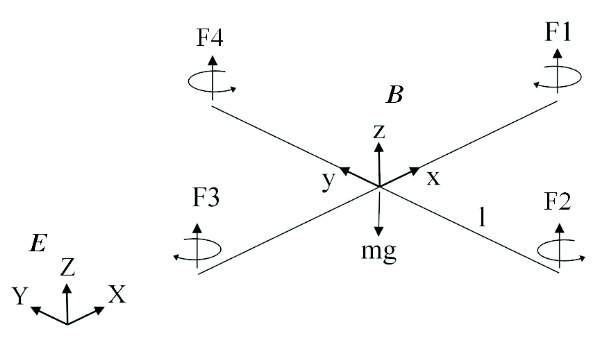

# 摘要
* 本文研究了微型飞行机器人（MFR）的建模、设计与控制，重点关注垂直起降（VTOL）系统和微型四旋翼飞机。
* 从最初仅适用于悬停的一组方程，演变成一个包含更真实的空气动力学系数以及传感器和执行器模型的复杂数学模型
* 本文开发了两个平台。第一个是测试平台，第二个是四旋翼
* 本文开发了五种不同的控制器。
  * 第一个控制器基于李雅普诺夫理论，用于姿态控制。
  * 第二个和第三个控制器基于 PID 和 LQ 技术，用于比较姿态控制性能。
  * 第四个和第五个方法使用反步法和滑动模态概念，用于姿态控制。
  最后，反步法与积分作用增强，并作为设计姿态、高度和位置控制器的单一工具。
  这种方法通过在 OS4 上进行的各种飞行实验得到了验证。

# Ch1 引言
## 1.1 动机和目标
* 背景
  * 飞行物体一直对人类充满吸引力，激励着各种研究和开发。本文的研究始于 2003 年，当时机器人社区对微型飞行器（MAV）开发表现出越来越浓厚的兴趣。在拥挤环境中对 MAV 设计和控制的科学挑战以及现有解决方案的缺乏，都非常有动力。另一方面，军事和民用市场广阔的应用领域也鼓励资助 MAV 相关项目。
  * 地面机器人在崎岖地形中的局限性以及微型技术的最新进展，促使我们开发新的机动概念。这包括飞行系统，可以在其上应用已在地面机器人上开发的技术。然而，这项任务并不简单，因为存在几个开放性的挑战。
  * 在感知技术领域，目前工业可以提供新一代的集成立体惯性测量单元（IMU），通常由微机电系统（MEMS）技术的惯性传感器和磁阻传感器组成。
* 动机
  * 惯性传感器的微型化要求使用 MEMS 技术，由于噪声和漂移，这种技术仍然远不如传统的传感器准确。
  * 使用低成本 IMU 与使用效率较低的数据处理同义，除了会导致方向数据预测不佳外，还会导致漂移抑制能力较弱。
  * 另一方面，尽管微型执行器在成本和尺寸方面取得了最新进展，但标度定律仍然不利，人们必须面对执行器饱和的问题。
  * 也就是说，即使微型飞行器的开发是可能的，控制仍然是一个具有挑战性的目标。
* 目标
  从一开始，本文就决定研究一种特定的 VTOL 配置：四旋翼飞机。
  这种兴趣不仅来自于其动力学，它代表了一个吸引人的控制问题，而且还来自于设计问题。
  将传感器、执行器和智能集成到轻量级垂直飞行系统中，并且具有合理的运行时间，这不是一件简单的事情。

## 1.2 State of the Art (研究现状）
* 近年来，四旋翼飞行器控制的研究现状发生了巨大变化。解决这个问题的研究项目数量急剧增加。
* 其中大多数项目都基于商用玩具，后来对其进行修改，以便具有更强的传感和通信能力。
* 只有少数小组解决了 MFR 设计问题，而且更少的组以最佳方式（同时考虑设计和控制）对四旋翼飞机进行了设计。
* 表 1.1 列出了过去 10 年中最重要的四旋翼飞行器项目。

## 1.3 本文贡献
* 专注于无人自主微型直升机的设计和控制，并将其应用于四旋翼直升机。贡献有三个方面：
  * 四旋翼飞行器的动态建模：目标是获得机械系统的忠实数学表示，用于系统分析和控制设计。
  * 系统设计和优化：目标是最大化飞行器的运行时间并最小化飞行器的重量。
  * 系统控制：目标是理解和掌握四旋翼飞行器的动力学，并应用适当的控制技术。
### Modelling 建模
* 开发了一个精确的模拟模型，该模型在逐步改进过程中得到完善。最初版本是一个简单的模型，描述了在悬停飞行中的飞行器，详见论文 [2]。它仅包括陀螺仪效应和执行器的动作。
* 该模型后来演变成一组更完整的方程，不仅描述了悬停时的飞行器动力学，还描述了运动中的飞行器动力学（详见 2.3 节）。这是通过引入摩擦力、轮毂力和旋翼滚动力矩等几个效应来实现的。
* 实现了一个包含空气动力学模块的模拟器，这允许考虑变量空气动力学系数，即推力、阻力、轮毂力和滚动力矩系数。
* 推进组模型被识别、简化和验证。整个模型在 Simulink 下实现，并用于优化设计和调整控制参数。
* 本文还开发了 OS4 模拟器，该模拟器考虑了传感器的延迟和噪声，并允许进行低级和高级控制器的模拟和控制设计，例如姿态、高度、位置控制以及避障和自主起飞和降落。

### Design 设计
* 本文提出了一种实用的方法来处理小型旋翼飞行器的设计问题，该方法结合了系统理论知识和系统级优化分析的结果
* 该方法基于应用，用户定义系统的目标尺寸和重量，算法从数据库中选择最佳组件并迭代估计最重要的设计参数。
* 两个四旋翼平台被设计，第一个平台主要是一个测试平台。第二个四旋翼设计名为 OS4。

### Control 控制
* 本文的一个重要部分是寻找四旋翼的良好控制方法。
* 本文探索了从理论发展到最终实验的各种技术。
* 首先，李雅普诺夫理论被应用于在测试平台上进行的直升机姿态控制。
* 然后，基于简化的模型研究了两种线性控制器，即比例积分微分（PID）和线性二次（LQ），主要结果是自主悬停飞行，详见论文 [3]。
* 在第三次尝试中，测试了反步法和滑动模态技术。这次，我们能够优雅地拒绝强干扰，但在悬停飞行中的稳定化比较困难，这将在论文 [4] 中详细说明。然后，由于积分反步法 [5]，引入了另一个改进。
* 通过这种方法，OS4 能够进行具有高度控制和自主起飞和降落的自主悬停。MAV 上的避障仍然是开放性问题，事实上，这不是本文的重点。

## 1.4 A Short Helicopter History 直升机的历史
* 人类对飞行的迷恋贯穿了人类的历史。
* 与固定翼飞机相比，直升机的历史相对较短。
* 目前，重要的努力正在投资于自主 MAV，其中微型化、自主性、控制、空气动力学和能源来源等挑战被解决。

# Ch2 System Modelling 系统建模
## 2.1 Concept and Generalities
* 本文中用于动态建模的概念是编写物理方程式，从 CAD 模型中获取参数，并仅识别对四旋翼而言重要的执行器动力学。这种方法使构建不稳定系统的动态模型变得容易，因为我们不需要在飞行中进行闭环识别。
* Euler-Lagrange 形式和直流电机方程用于模拟测试平台。
  牛顿-欧拉形式、模型识别和叶片元素和动量理论用于模拟 OS4 四旋翼飞行器。
  Tait-Bryan 角用于参数化。后者模型作为模拟器实现。
* 本文开发的整个模型假设如下：
  结构被认为是刚性的。
  结构被认为是对称的。
  重心和质量中心固定坐标系的原点被认为是重合的。
  旋翼被认为是刚性的。
  推力和阻力与旋翼速度的平方成正比。
* 直升机是一个复杂的机械系统，它汇集了来自空气动力学和力学领域的众多物理效应 [17]。
  四旋翼飞行器的模型应该考虑所有重要的效应，包括陀螺仪效应。
  一个简短的清单描述了作用在直升机上的主要效应 [18]，如表 2.1 所示。
  效应	来源	公式
  空气动力学效应	旋翼旋转	CΩ^2
  惯性反扭矩	旋翼旋转速度的变化	J ˙Ω
  重力效应	质心位置	G
  陀螺仪效应	刚体方向的改变	Iθψ
  陀螺仪效应	旋翼平面方向的改变	JΩrθ, φ
  摩擦力	直升机的所有运动	C ˙φ, ˙θ, ˙ψ

## 2.2 Modelling with Euler-Lagrange Formalism 使用 Euler-Lagrange 形式建模
* 本节使用 Euler-Lagrange 形式对测试平台的旋转动力学进行建模。详细的数学推导可在附录 B.2 中找到。
* 让我们考虑地球固定坐标系 E 和质心固定坐标系 B。
  
  机身在空间中的方向由从 B 到 E 的旋转 R 给出，其中 R ∈ SO3 是旋转矩阵。
### 2.2.1 Kinematics 运动学
* 对于在地球固定坐标系中表示的机身上的任何一点，我们可以写出 (用 c:cos, s:sin）：
$$
\begin{bmatrix}r_X\\r_Y\\r_Z\end{bmatrix} = R
\begin{bmatrix}x\\y\\z\end{bmatrix}
$$ 
「注意，作者给的矩阵R与我的B123的定义不同」。
对应的速度由该式进行微分获得，任何一点的速度的平方模量为：
$$
ν^2 = ν^2_X + ν^2_Y + ν^2_Z
$$

### 2.2.2 Energy 能量
* 从方程 (2.2) 中，并假设惯性矩阵对角线化，可以提取动能表达式
$$
T = 1/2Ixx( ˙φ − ˙ψsθ)^2 + 1/2Iyy( ˙θcφ + ˙ψsφcθ)^2 + 1/2Izz( ˙θsφ − ˙ψcφ)
$$
* 使用众所周知的势能公式，我们可以将 (2.3) 在地球固定坐标系中表示为
$$
V = Z/xdm(x)(−gsθ) + Z/ydm(y)(gsφcθ) + Z/zdm(z)(gcφcθ)
$$

# 附录B 建模
## B.1 旋转矩阵
* 作者给出的 Rx,Ry,Rz与我的定义相同，与全权老师的是互为转置，因为全权老师给出的是坐标系的旋转，
而我给出的是向量的旋转。
* 作者给的R与全权老师的相同，但与我的不同。最明显的是，从作者的R=RxRyRz得到的R不一致，这说明形式验证的重要性。
  作者和全老师的R是B321，而我的是B123。
* 

