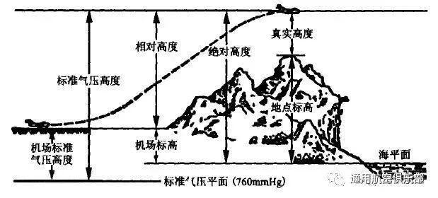
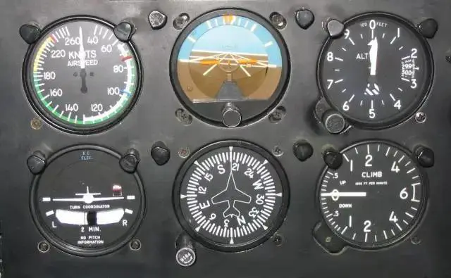
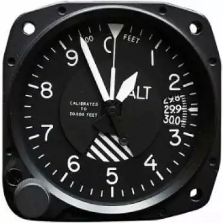
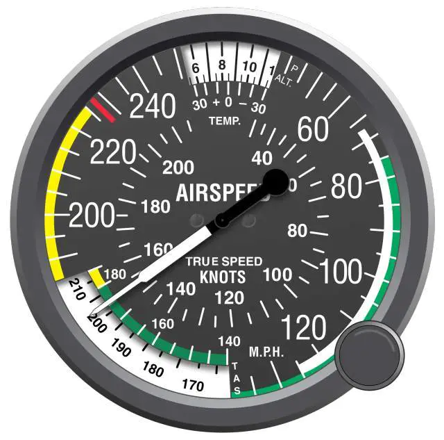
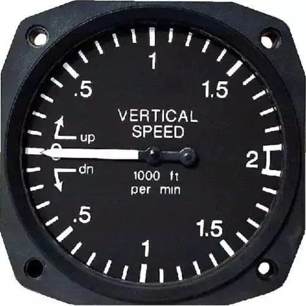
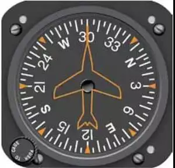
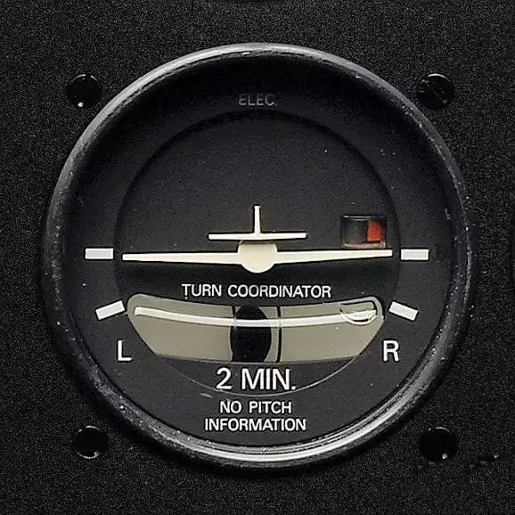
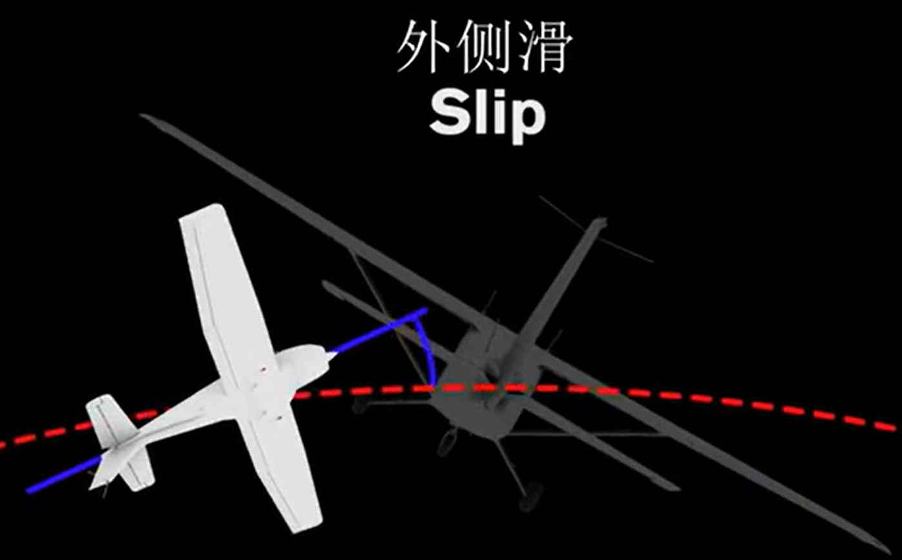
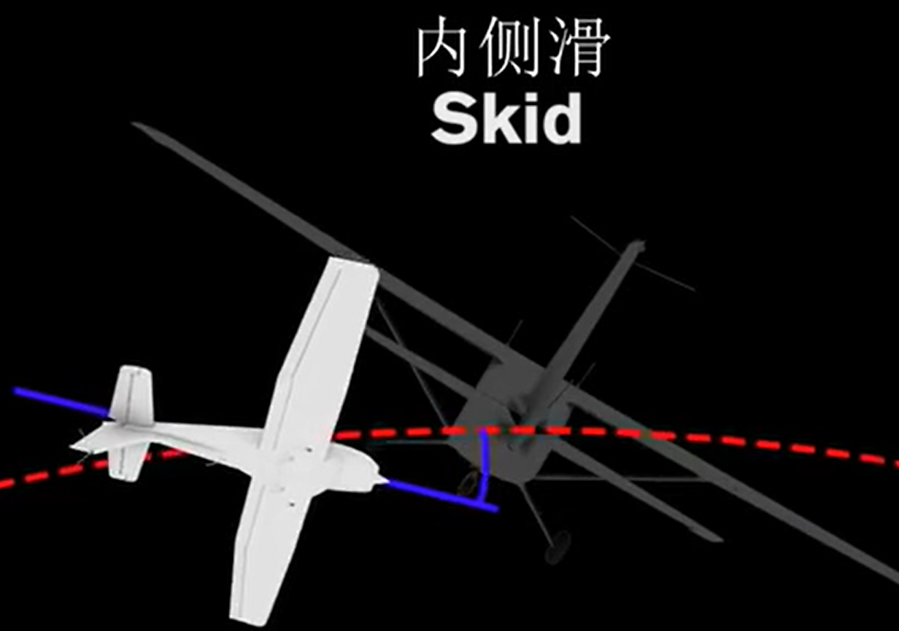

# 飞机仪表盘的基础认识

## 1. 飞行器的一些常规参数

* 飞行高度

  飞机的飞行高度是指飞机在空中距某一个基准面的垂直距离。

  

  根据所选基准面，飞行中使用的飞行高度大致可分为以下四种：

  * **绝对高度**

    飞机从空中到平均海平面的垂直距离也称为绝对高度。在海上飞行时，需要知道绝对高度。

  * **相对高度**

    飞机从空中到某一既定机场地面的垂直距离称为相对高度。飞机起飞、降落时，必须知道相对高度。

  * **真实高度**

    飞机从空中到正下方接触面（水面，地面，山顶等）的垂直距离称为真实高度。在飞越高山，空中摄影、航测时，需要准确测量真实高度。

  * **标准气压高度**

    飞机从空中到标准气压海平面的垂直距离称为标准气压高度。标准气压高度是国际上通用的高度，飞机在加入航线时使用的高度，主要防止同一空域、同一航线上的飞机在同一气压面上飞行时两机发生相撞。

    飞机一般在对流层和同温层下面飞行。在这个范围内，空气的物理性质——温度、压力、密度等都经常随着季节、时间、地理位置、高度等的不同而变化。为了确定飞机的飞行性能，必须按同一标准的大气物理性质——温度、压力、密度等进行换算，才能对各种飞机的飞行性能进行相互比较。

  气温、高度、气压、大气密度的关系：

  * 气温与高度的关系：升高单位高度，气温降低的数值，称为气温垂直递减率。不同季节，不同地区，不同高度时的气温垂直递减率是不一样的。

  * 大气密度与高度的关系：大气密度随温度升高而减小。即高度升高大气密度减小；高度降低，大气密度增加。

  * 气压与高度的关系：根据标准大气条件可以推导出气压与高度的关系。无论在任何高度上，高度与气压都存在一一对应的关系。如果测出某高度处的气压，就可以换算出该处的标准气压高度。

  高度的单位换算

  * 1米=3.28英尺，1英尺=0.3
  * 3万英尺，相当于9144米。

* 飞行器飞行高度大排名

  * 大气层阶段（低于100千米）

    大爷手里的风筝：20-100米

    无人机：500米

    热气球：1000米

    直升机：平均6000米（法国SA-3158型“美洲鸵”直升机，创造了飞行高度1.2442万米的世界纪录。）

    民用飞机：1.3万米（13千米）

    战斗机：一般在9万米-1.5万米（15千米）美国F-22能爬升至2万米，俄国苏-57爬升1.9万米，我国歼-20据军迷推测能爬升至1.9万米。

    美国维珍太空船公司团结号：86千米

  * 外太空阶段（大于等于100千米）

    蓝色起源（新谢泼德号）火箭：100千米

    中国空间站：380-400千米

    国际空间站：422千米

    哈勃望远镜：540千米

    spaceX激励4号：585千米

    斯普特尼克1号：939千米（1957年10月4日，世界上第一颗人造地球卫星“斯普特尼克1号”从拜科努尔发射场升空。虽然这颗卫星只会在太空噼啪作响，但它标志着人类的活动疆域已经从陆地、海洋、大气层扩大到了宇宙空间，人类从此打开天门，放眼宇宙。）

    洲际弹道导弹：1200千米

    极轨气象卫星：飞行高度约为600～1500千米，卫星的轨道平面和太阳始终保持相对固定的交角，这样的卫星每天在固定时间内经过同一地区2次，因而每隔12小时就可获得一份全球的气象资料。

    GPS卫星：20180千米

    北斗导航卫星：21500千米

    同步气象卫星：运行高度约35800千米，其轨道平面与地球的赤道平面相重合。从地球上看，卫星静止在赤道某个经度的上空。一颗同步卫星的观测范围为100个经度跨距，从南纬50°到北纬50°，100个纬度跨距，因而5颗这样的卫星就可形成覆盖全球中、低纬度地区的观测网。

* 飞行速度，节（knot），单位符号kn，用于航海的速率的单位，后来延伸至航空，相当于船只或飞机每小时所航行的海里数。比如，每小时航行1海里的速度叫1节。1节=1海里/小时=1.852千米/小时=0.514米/秒。

* 长度单位，海里。符号 n mile 。1海里约1852米。它等于地球椭圆子午线（经线）上纬度1分（一度等于六十分，一圆周为360度）所对应的弧长。

  * 地球赤道周长是40076千米，所以1.852x60x360就是4万。

  * 由于地球子午圈是一个椭圆，它在不同纬度的曲率是不同的，因此，纬度1分所对应的弧长也是不相等的。
  * 由于地球是一个赤道略鼓、两极稍扁的椭球体，当纬度为0度，即在赤道附近时，1海里的长度最短，为1842.94m；在两极附近最长（纬度为90度），为1861.56m。约在44度14分处，1n mile的长度等于1852m。

  

## 2. 仪表盘

* 参考资料

  [全网最全面飞机仪表系统讲解-中英双字](https://www.bilibili.com/video/BV1n44y1p7q4)

* 概貌

* 高度表

  高度表（Altimeter）连接飞机静压管来测量大气压力，提供飞机高度的资讯(以米及英尺为单位)。高度通常是显示海平面上高度。飞行员在飞行时，每飞过一地，要调整高度表的设定，为当地的气压表拨定值，高度表才能显示正确的高度。

  

  上图，量程最大是10（x1000英尺），及1万英尺，等于3048米。

* 空速表

  空速表（Airspeed Indicator）连接至飞机的动压管及静压管，测量冲压空气的压力，转换为飞机的指示空速（Indicated Airspeed），单位通常为节。

  

  图中，KNOTS是节。1节是1海里每小时，相当于1.8公里每小时。这里最大量程220节，相当于396公里/小时。动车已经可以达到350公里每小时。

* 垂直速率表

  垂直速率表（Verticalspeed Indicator）连接至静压管，测量机外大气压力变化的速率，在垂直速率表上，显示飞机爬升及下降的速率，单位通常为“英尺/每分钟”(fts/min)。

  

  图中，上面是爬升速率，下面是下降速率，单位是1千英尺/分钟，量程是2千英尺每分钟，约10米/秒。

* 姿态仪

  姿态仪（Attitude Indicator）显示飞机相对于地平线的姿态，看姿态仪，飞行员能判断飞机姿态为偏左偏右，及偏上和偏下。

* 航向指示表

  航向指示表（heading Indicator）的原理为一高度旋转的陀螺，不论飞机的航向变动，此陀螺的定轴性都保持一样，因能显示出飞机机头的磁方位。由于陀螺的进动性，航向指示表的指示会逐渐产生误生，因此飞行员必须时时依磁罗盘的指示，来校正航向指示表。

  

  图中，ESWN表示东南西北。数字从0~36表示0度到360度。0度是正北N，90度是正东E，180度是正南S，270度是正西W。

* 转弯协调表（也叫转弯侧滑仪）

  转弯协调表也是陀螺仪表，指示转弯的方向及飞机转弯的速率。转弯协调表亦可显示飞机的转弯是否为协调转弯（CoordinatedTurn），转弯协调表可作为

  姿态仪的辅助仪表，在仪表飞行时，转弯协调表可指示应有的转弯速率（度/秒）。

  

  图中，2min是指，标准转弯速度是2min转360度。中间小飞机图标的下面有一个倾斜计（Inclinometer），由装满煤油的管道和其中的小球组成。小球可以向左右自由移动并指示气动力的方向。理想情况下小球在中间位置位置，意味着飞机处于协调状态，如果气动力不平衡小球会左右移动。这证明飞机在横滚的时候蹬舵太多或太少。这两种情况分别称为外侧滑（Slip）和内侧滑（Skid）

     

  * 外侧滑：相对于横滚偏航不足，飞行员应该增加偏航或减小横滚
  * 内侧滑：相对于横滚偏航过量，飞行员应该减小偏航或增大横滚

  校正方法是，小球偏向哪边（左或有），就踩哪边的脚蹬。【脚蹬控制偏航，左侧控制左偏航，右侧踩下控制右偏航）。

  

* 